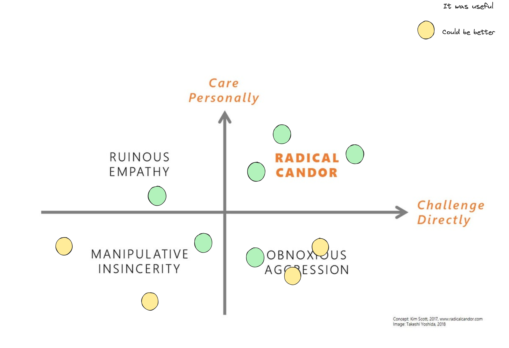
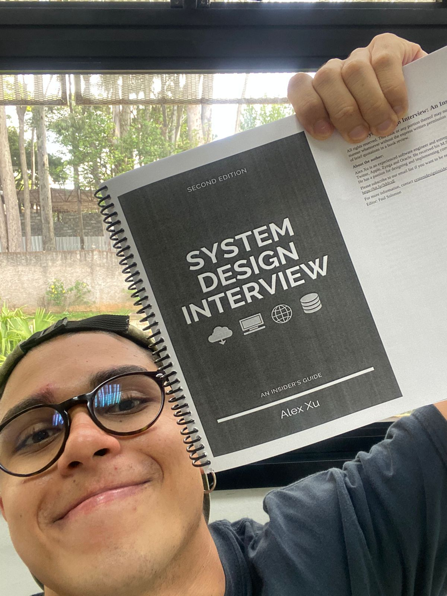

# Books

A collection of books I've read with notes and summaries.

---

## Book List

| Book | Author | Amazon Link |
|------|--------|-------------|
| A Árvore Mais Sozinha do Mundo | - | [Amazon](https://www.amazon.com.br/s?k=A+%C3%A1rvore+mais+sozinha+do+mundo) |
| A Carne | Rosa Montero | [Amazon](https://www.amazon.com.br/s?k=A+carne+Rosa+Montero) |
| A Fé e o Fuzil | Bruno Paes Manso | [Amazon](https://www.amazon.com.br/s?k=A+f%C3%A9+e+o+fuzil+Bruno+Paes+Manso) |
| A Origem da Desigualdade entre os Homens | Rousseau | [Amazon](https://www.amazon.com.br/s?k=A+origem+da+desigualdade+entre+os+homens+Rousseau) |
| A Paixão Segundo G.H. | Clarice Lispector | [Amazon](https://www.amazon.com.br/s?k=A+paix%C3%A3o+segundo+GH+Clarice+Lispector) |
| A Philosophy of Software Design | John Ousterhout | [Amazon](https://www.amazon.com.br/s?k=A+Philosophy+of+Software+Design+John+Ousterhout) |
| A Viena de Freud | - | [Amazon](https://www.amazon.com.br/s?k=A+Viena+de+Freud) |
| Cien Años de Soledad | Gabriel García Márquez | [Amazon](https://www.amazon.com.br/s?k=Cem+anos+de+solid%C3%A3o+Gabriel+Garcia+Marquez) |
| Civilization and Its Discontents | Sigmund Freud | [Amazon](https://www.amazon.com.br/Civilization-Discontents-English-Sigmund-Freud-ebook/dp/B07MPCSC9B) |
| Discurso sobre as Ciências e sobre as Artes | Rousseau | [Amazon](https://www.amazon.com.br/s?k=Discurso+sobre+as+ci%C3%AAncias+e+sobre+as+artes+Rousseau) |
| Dune | Frank Herbert | [Amazon](https://www.amazon.com.br/Dune-Frank-Herbert/dp/0441172717) |
| Educação como Prática da Liberdade | Paulo Freire | [Amazon](https://www.amazon.com.br/s?k=Educa%C3%A7%C3%A3o+como+pr%C3%A1tica+da+liberdade+Paulo+Freire) |
| Eichmann em Jerusalém | Hannah Arendt | [Amazon](https://www.amazon.com.br/s?k=Eichmann+em+Jerusal%C3%A9m+Hannah+Arendt) |
| Esaú e Jacó | Machado de Assis | [Amazon](https://www.amazon.com.br/s?k=Esau+e+Jac%C3%B3+Machado+de+Assis) |
| Felizes por Enquanto | Geni Núñez | [Amazon](https://www.amazon.com.br/Felizes-por-enquanto-Escritos-poss%C3%ADveis/dp/8542228596) |
| Five Lectures on Psycho-Analysis | Sigmund Freud | [Amazon](https://www.amazon.com.br/s?k=Five+Lectures+on+Psycho-Analysis+Freud) |
| Freud - O Infamiliar (Das Unheimliche) | Sigmund Freud | [Amazon](https://www.amazon.com.br/s?k=Freud+O+infamiliar) |
| Freud (1901-1905) - Obras Completas Vol. 6 (Três ensaios sobre a teoria da sexualidade, O caso Dora e outros textos) | Sigmund Freud | [Amazon](https://www.amazon.com.br/s?k=Freud+Obras+completas+Volume+6) |
| História da Sexualidade Vol. 1 - A Vontade de Saber | Michel Foucault | [Amazon](https://www.amazon.com.br/s?k=Hist%C3%B3ria+da+sexualidade+1+Foucault) |
| Jonathan Livingston Seagull | Richard Bach | [Amazon](https://www.amazon.com.br/s?k=Jonathan+Livingston+Seagull+Richard+Bach) |
| Learning Go | Jon Bodner | [Amazon](https://www.amazon.com.br/s?k=Learning+Go+Jon+Bodner) |
| Los Vencejos | Fernando Aramburu | [Amazon](https://www.amazon.com.br/Los-Vencejos-Fernando-Aramburu/dp/8490669988) |
| Lugar de Negro | Lélia Gonzalez & Carlos Hasenbalg | [Amazon](https://www.amazon.com.br/s?k=Lugar+de+Negro+L%C3%A9lia+Gonzalez) |
| Malcolm X | Alex Haley | [Amazon](https://www.amazon.com.br/s?k=Autobiography+of+Malcolm+X) |
| Mundo em Disputa | Marcia Tiburi | [Amazon](https://www.amazon.com.br/s?k=Mundo+em+disputa+Marcia+Tiburi) |
| Neuroses and Non-Neuroses | Marion Minerbo | [Amazon](https://www.amazon.com.br/s?k=Neuroses+Marion+Minerbo) |
| Non-Things: Upheaval in the Lifeworld | Byung-Chul Han | [Amazon](https://www.amazon.com.br/s?k=Non-Things+Byung-Chul+Han) |
| Normatividade Vital em Georges Canguilhem | - | [Article](https://www.scielo.br/j/sausoc/a/NK6WVy885ksS9RBr4SWTqsR/) |
| Norwegian Wood | Haruki Murakami | [Amazon](https://www.amazon.com.br/s?k=Norwegian+Wood+Haruki+Murakami) |
| O Dilema do Porco Espinho | Leandro Karnal | [Amazon](https://www.amazon.com.br/s?k=O+Dilema+do+Porco+Espinho+Leandro+Karnal) |
| Ponciá Vicencio | Conceição Evaristo | [Amazon](https://www.amazon.com.br/s?k=Ponci%C3%A1+Vicencio+Concei%C3%A7%C3%A3o+Evaristo) |
| Psicologia das Massas e Análise do Eu | Sigmund Freud | [Amazon](https://www.amazon.com.br/s?k=Psicologia+das+massas+e+an%C3%A1lise+do+eu+Sigmund+Freud) |
| Radical Candor | Kim Scott | [Amazon](https://www.amazon.com.br/Radical-Candor-Kick-Ass-Without-Humanity/dp/1250103509) |
| Rasta and Resistance | Horace Campbell | [Amazon](https://www.amazon.com.br/Rasta-Resistance-Marcus-Garvey-Walter/dp/0865430357) |
| Realismo Capitalista | Mark Fisher | [Amazon](https://www.amazon.com.br/s?k=Realismo+capitalista+Mark+Fisher) |
| Seven Concurrency Models in Seven Weeks | Paul Butcher | [Amazon](https://www.amazon.com/Seven-Concurrency-Models-Weeks-Programmers/dp/1937785653) |
| Sobre o Óbvio | Darcy Ribeiro | [Amazon](https://www.amazon.com.br/s?k=Sobre+o+%C3%B3bvio+Darcy+Ribeiro) |
| System Design Interview | Alex Xu | [Amazon](https://www.amazon.com.br/System-Design-Interview-Insiders-English-ebook/dp/B08B3FWYBX) |
| The 48 Laws of Power | Robert Greene | [Amazon](https://www.amazon.com.br/s?k=The+48+Laws+of+Power+Robert+Greene) |
| The Hard Thing About Hard Things | Ben Horowitz | [Amazon](https://www.amazon.com.br/s?k=The+Hard+Thing+About+Hard+Things+Ben+Horowitz) |
| The Pragmatic Programmer | David Thomas & Andrew Hunt | [Amazon](https://www.amazon.com.br/s?k=The+Pragmatic+Programmer) |
| The Site Reliability Engineering | Google | [Free Online](https://sre.google/sre-book/table-of-contents/) |
| The Software Engineer Guidebook | Gergely Orosz | [Amazon](https://www.amazon.com.br/s?k=The+Software+Engineer+Guidebook+Gergely+Orosz) |
| Triste Fim de Policarpo Quaresma | Lima Barreto | [Amazon](https://www.amazon.com.br/s?k=Triste+fim+de+Policarpo+Quaresma+Lima+Barreto) |
| Tudo é Rio | Carla Madeira | [Amazon](https://www.amazon.com.br/Tudo-%C3%A9-rio-Carla-Madeira/dp/6555871784) |
| What You Do Is Who You Are | Ben Horowitz | [Amazon](https://www.amazon.com/What-You-Do-Is-Who-You-Are-audiobook/dp/B07XVPLHV9) |

---

## Summaries

### A Fé e o Fuzil - Bruno Paes Manso

Crime e religião no Brasil do século XXI.

---

### A Paixão Segundo G.H. - Clarice Lispector

Difícil de entender qual a motivação da autora depois da metade do livro, análise sobre análises, sobre análises. Uma barata vira motivo de reflexão, uma sombra, um vaso, a poeira no guarda roupa.

Me lembra um pouco as poesias de Manoel de Barros, que se apega ao ínfimo para tentar entender o mundo.

```
Na verdade, na verdade, os passarinhos que botavam primavera nas palavras.

Manoel de Barros
```

O mesmo para Clarice, que se abraça na solidão de seu quarto, tentando entender e dar sentido para sua vida normal e aparentemente sem graça.

---

### A Philosophy of Software Design - John Ousterhout

In this book, John Ousterhout specifically talks about software decomposition, when is the best time to split code, make it more modular, and what techniques and principles can be taken into account to make these decisions.

A question before continuing: What differentiates a good developer from a great developer?

According to the book "Talent Is Overrated: What Really Separates World-Class Performers from Everybody Else", talent is a mix of a few factors:

* *Prática deliberada*
* *Dedicação*
* *Resiliência*

In short: working smart, focused, and with clear goals is what makes anyone, not just developers, better at what they do.

#### Chapter 1 - Introduction (It's all about complexity)

* The bigger the program and the more people working on it, the harder it is to manage complexity.
* Complexity will still increase over time. Despite our best efforts, simpler designs allow us to build larger, more powerful systems.
* There are 2 general approaches to dealing with complexity:
  * Eliminate it by making it simpler and more obvious.
  * Encapsulate it.
* Encapsulation is the process of hiding complexity behind a simpler interface. It allows us to build complex systems without having to understand all the details of how they work.

Unlike physical projects (bridges and buildings), software has a different characteristic. What was used in the past was a code production model called the `waterfall model`, which aimed to design the system completely before it was even implemented. As a result, the initial design had many problems that only appeared when implementation began.

Because of these problems, most projects began to adopt agile development, based on incremental software development, where it is emphasized that the first deliveries are just a small piece of a final delivery, which is gradually increased as the product is evaluated by customers.

In other words, incremental development means that the software is never ready; the design happens constantly throughout the life of the project.

#### Chapter 7 - Different layers, different abstractions

If the system contains layers with similar abstractions, this is a red flag that suggests problems with class decomposition. But in some cases this is not a problem, for example:

**Dispatcher**: A component responsible for directing or transferring control, data or tasks to the appropriate component or layer. It selects one of several possible methods and to do that, it needs to have the same signature of the methods it is dispatching to.

**Decorators**

**Red flag**: A pass-through method is one that does nothing except pass its arguments to another method.

#### Chapter 8 - Pull Complexity Downwards

- Usually you have more users than developers. So moving the complexity to the users couldn't be a good idea.
- Move the complexity to the code/class/method, could be noise, but this can save user time/overhead.
- Sometimes we manage complexity through parameters and configuration, but this can be a problem. How will the user know if the 1000 limit size for their LRU cache is better than 1001? Sometimes this freedom is not too good.

#### Chapter 9 - Better Together or Better Apart

Given two pieces of functionality, should they be implemented together in the same place, or should their implementation be separated?

It might appear that the best way to achieve this goal is to divide the system into a large number of small components: the smaller the components, the simpler each individual component is likely to be. However, the act of subdividing creates additional complexity that was not present **before** the division:

* The more components, the harder to keep track of them all.
* Subdivision can result in additional code to manage the components.
* Subdivision creates separation: the subdivided components will be farther apart than they were before subdivision.
* Subdivision leads to duplication.

Indicators that two pieces of functionality are closely related:

* They share information.
* They are used together. Anyone using one of the pieces of code is likely to use the other as well.
* They overlap conceptually. They are part of the same abstraction, or part of the same conceptual model.
* It's hard to understand one without understanding the other.

---

### Civilization and Its Discontents - Sigmund Freud

Reference: [CONSIDERAÇÕES SOBRE O MAL-ESTAR NA CIVILIZAÇÃO](https://slab.uff.br/wp-content/uploads/sites/101/2020/01/Texto_Gizelle_Falbo_selecao2020.pdf)

---

### Discurso sobre as Ciências e sobre as Artes - Rousseau

#### Questão: Ciências e artes → Purificam os costumes?

#### Recomendações

- Rousseau - Contrato Social
- Kant - Que é esclarecimento
- Pierre Bourdieu
- Pierre Bourdieu - **Os Herdeiros: Os Estudantes e a Cultura**

#### Termos

**Indução**: vem do latim *inductio* — "condução" ou "levar para dentro". Em filosofia, método de inferir uma conclusão a partir de evidências particulares.

**Retificação**: vem do latim *rectificatio* — "ação de endireitar" ou "ação de corrigir".

**Entfremdung**

**Politesse**: vem do francês — "cortesia" ou "bondade". Refere-se às maneiras e formas adequadas de se comportar em situações sociais.

**Exigência de agradar**

Costumes não naturais

**Separação ser/parecer** x **Aparecer como se é**

#### Aula 12/01

Retificação da teoria de que **quanto mais desenvolvidas são as artes e as ciências mais os costumes são elevados** — Rousseau discorre sobre o oposto.

Artes:
- Utilitária → técnica (leitura)
- N utilitária → Estética (pintura)

Costumes: Modelos de condutas

**Sutilezas metafísicas**:
- Lei
- Não concreto

**Induções históricas**:
- Fatos
- Concreto

> Não se afiliar sem refletir, sobre as posições e costumes de sua época
>
> Não subjugar-se às opiniões da época

Antes: Ignorância e barbárie

Transição (1453):
- Cultura da antiga Grécia
- Renascimento - Ciências, letras e artes

Hoje: Esclarecida

> Em vida social nós dependemos dos outros. Ponto importante para considerarmos um limite da liberdade. Não julgá-la como o limite da sua força.

> Simular virtudes e dissimular defeitos

Cisão entre o ser e o parecer, que opera entre todas as relações sociais.

> Letras, ciências e artes → corrupção dos costumes

Os homens se desconhecem como consequência, eles desenvolvem vícios:
- Sem amizade sincera, confiança fundada
- Suspeita, traição, medo
- Vícios decorados com nomes de virtude (Amor = Posse)

**Antes e depois das ciências e artes:**

- **Egito**: Antes: Conquistadores → Depois: subjugados
- **Grécia**: Antes: Vencedores → Depois: Corrupção cotidiana, escravizados
- **Roma**: Antes: Virtude, dominadora → Depois: Degenerada, crimes, subjugada

#### Aula 19/01

> Para agradar você precisa satisfazer os prazeres dos outros

Esse comportamento é provindo das artes e ciências. Quanto mais rústica a origem do homem, mais desvencilhado desse modo de operar.

Filosofia é um saber vago, o que motiva seu estudo é o **espanto**.

Luxo (coisas supérfluas, dispensáveis) → (produz) as **artes**

Injustiça → Jurisprudência

Tirania + Guerras + Conspirações → História

Negligência à pátria + infelizes + amigos + deveres + necessidades naturais → Contemplações estéreis.

Rousseau possui argumentos fortes? O que são argumentos fortes? Na visão do professor:
- Condição inicial como definitivo
- Parte como todo
- Imprecisão → Impertinência

Ciências, artes e letras são ocupações ociosas, tranquilas e sedentárias.

#### P2 Formação do pensamento filosófico

**1.1. As ciências, as artes e letras corrompem ou purificam os costumes?**

Corrompem. Na primeira parte de seu discurso, Rousseau fomenta que a dissimulação das virtudes e distanciamento da rusticidade natural do homem se dá em sociedades onde existe o aumento das ciências, letras e artes.

**1.2. Do ponto de vista metodológico, qual o significado das "induções históricas", isto é, qual a relação entre a tese de Rousseau e essas "induções históricas"?**

Rousseau busca fortalecer seus argumentos por exemplos históricos que possuem pontos em comum com sua base argumentativa, em especial, formações sociais de grandes sociedades, como Egito, Grécia e Roma. Usando essas formações sociais como exemplo, ele infere que o distanciamento dos costumes se acentuou nessas cidades, justamente pela dissolução da moralidade e dos valores sociais, causados pela ampliação das ciências, artes e letras.

**1.3. Do ponto de vista conceitual, quais os resultados que essas induções históricas oferecem para embasar e explicitar a tese de Rousseau, isto é, quais eram as principais características das sociedades antes e depois do desenvolvimento das ciências, das artes e das letras?**

É possível observar que as sociedades apresentadas nas análises históricas por Rousseau apresentam pontos altos e baixos em sua formação. Em especial, os pontos negativos se acentuam pela ampliação das CLAs. Como exemplo: Roma, que se caracterizou por ser uma sociedade virtuosa e dominadora, mas passou a ser degenerada, subjugada e com muitos crimes. Outro exemplo é a Grécia, que foi um povo vencedor, mas que ficou marcada pela escravidão e corrupção.

**1.4. Na Segunda Parte do Discurso, Rousseau analisa as ciências, as artes e as letras, relacionando-as com os costumes. Quais são os principais aspectos dessa análise?**

Dois aspectos: no primeiro, para Rousseau, as CLAs pressupõem o luxo, e sociedades que se formaram com esse aspecto possuem anseios fúteis — tal formação social não consegue decidir o rumo dos costumes, já que por agirem dessa forma, se distanciam cada vez mais de sua rusticidade e comportamento natural para serem benquistos socialmente, pois precisam simular virtudes e dissimular seus defeitos. Como segundo aspecto, o vício pela produção das CLAs, onde Rousseau faz provocações se a utilização desse conhecimento gerado de fato conseguiu servir para tornar a sociedade um lugar melhor ou somente para alimentar o ego de filósofos e cientistas da época.

---

### Dune - Frank Herbert

Pretty fun reading, the english version it's being hard for me.

---

### Educação como Prática da Liberdade - Paulo Freire

#### Termos

- Pauperizar = empobrecer
- Relevo = tem origem no latim *relevare*, que significa "levantar".
- Círculo de cultura = Unidade de ensino que substitui a "escola", autoritária por estrutura e tradição.
- Maiêutica = método de ensino Socrático, que envolve realizar uma série de questões para ajudar alguém a alcançar mais a fundo sobre um tópico.
- Filisteísmo = Amplamente utilizado para se referir à falta de interesse ou apreciação pela cultura, literatura, arte, música, teatro e outras formas de expressão artística. Vem do termo "filisteu", nome dado a um povo que habitava a região da Filístia, na antiga Palestina.
- Celeuma = tumulto/alvoroço.
- Sociologia = Campo de estudo dentro das ciências sociais, que se dedica a analisar as relações sociais, culturais e políticas entre indivíduos e grupos dentro de uma sociedade.
- Oligarquia = Oligos = pequeno/pouco | arkhein = governar/comandar. Governo de poucos.

#### Sobre a democracia

A palavra democracia possui origem na Grécia antiga, no século V a.C. Literalmente significa: Governo do povo. *demos* = povo | *kratos* = poder. A democracia nasceu na Grécia, em Atenas, e foi uma inspiração para muitos movimentos democráticos ao longo da história. Nesta época existiam assembleias, tribunais e conselhos populares, para garantir que o povo (homens adultos) pudesse exercer seu direito de poder político.

Esse movimento nasce da ascensão social da classe média ateniense e sua insatisfação com o governo tirânico, levando-os à criação de um novo sistema político baseado na participação direta dos cidadãos.

#### Educação e política: Reflexões sociológicas sobre uma pedagogia da liberdade

É urgente alfabetizar e conscientizar a população pauperizada, que sofre em um sistema desigual e opressor.

A visão pedagógica de Paulo Freire se torna efetiva e completa quando os educandos participam de forma crítica e livre no seu processo de aprendizado.

Para isso a proposta metodológica, círculo de cultura, unidade de ensino que substitui a escola, entra como ferramenta nesse processo. O esquema de ensino autoritário e bancário deixa de ser necessário, e abre espaço para um movimento de educação popular, onde, intermediado por um coordenador (que não é dito professor), faz-se o processo de intermediar o diálogo.

Outro ponto importante no processo de alfabetização é colocar em confronto as *palavras geradoras*, já que todo aprendizado deve encontrar-se intimamente associado à tomada de consciência da sua situação real vivida. Portanto, aproximar o vocabulário do alfabetizando é uma ferramenta importante no processo.

O Círculo se constitui em um grupo de debate, seu interesse central é o debate da linguagem no contexto social. Liberdade e crítica que não podem se limitar às relações internas do grupo, mas que se apresentam na **tomada de consciência que este realiza de sua situação social**.

#### A sociedade brasileira em transição

- O homem faz parte do seu processo evolutivo e da sociedade em que vive.
- O homem não está preso a uma corrente temporal que se resume ao hoje, mas é resultado de todo processo evolutivo até sua formação.

**Transitividade**: Uns que pretendiam manter a história para conservar seus privilégios e outros que querem avançar a história, em um movimento quase sufocante para conquistar mais direitos.

A saúde para essa estranha democracia está no silêncio do povo. No imobilismo.

**Subversividade**: dizem por ameaçar a ordem — porém, qual conceito de ordem estamos falando? Todo processo de formação histórica se deu por vias anárquicas.

Em uma sociedade tão desigual é quase impossível viver sem o desencadeamento de forças intensamente emocionais.

**Assistencialismo**: O grande problema no assistencialismo está no seu antidiálogo, que, impondo ao homem mutismo e passividade, não lhe oferece condições para o desenvolvimento de sua consciência. Sem essa consciência é impossível ver o homem brasileiro integrar-se à sua sociedade em transição.

Existir é um conceito dinâmico. Implica um dialogação eterna do homem com o homem. Do homem com o mundo. Do homem com o seu criador. Esse diálogo do homem com o mundo é debater de fato sobre os problemas que assolam a sociedade.

#### Transitividade crítica e ingênua

**Irracionalismo sectário** (intolerante) = postura caracterizada por uma devoção irracional e fanática a certos princípios ou ideias, implicando na recusa em considerar ou avaliar criticamente outras ideias.

---

### Felizes por Enquanto - Geni Núñez

There is no single way of being or existing in the world, nor a right or wrong way to relate. In fact, beauty lies in coexistences. The narrative craft that Guarani activist, psychologist and writer Geni Núñez builds in *Felizes por enquanto* shows that, beyond what was forcibly taught during so many centuries of colonization, there are indeed other possible worlds, in which things are not thought from binaries, impositions, or constraints. The charm, after all, is in also finding beautiful what is not a mirror.

Her writings, themselves unclassifiable, strip words of their utilitarian function and map a path in which life happens as it is lived, without following a straight line, in a time and memory that are always in motion.

> And, in our smallness of immensity, we get frustrated, we smile, we cry, we love, we desire... Precisely because we are alive. To be moved rather than anesthetized.

---

### Learning Go - Jon Bodner

#### Chapter 6: Pointers

- Zero value equals nil: pointer, slice, maps and functions.
- The `&` is the address operator that returns the address of the memory location.
- `*` is the indirection operator. It returns the pointed-to-value. This is called dereferencing.
- Before dereferencing a pointer, you should check if it is nil. Otherwise you will get a panic.
- Modern software engineering embraces immutability.

```
[I]mmutable types are safer from bugs, easier to understand, and more ready for change. Mutability makes it harder to understand what your program is doing, and much harder to enforce contracts.
```

- Go uses pointers to declare that some variables and parameters are immutable.
- Go developers use pointers to indicate that a parameter is mutable.

#### Chapter 10 - Concurrency in Go

1. People are attracted to concurrency because they believe concurrent programs are faster. Unfortunately, that is not always the case. More concurrency doesn't automatically make things faster.

```
"more concurrency does not mean more speed."
```

2. "Another important thing to note is that concurrency isn't worth using if the process that's running concurrently doesn't take a lot of time. This is why concurrent operations are often used for I/O."

#### Goroutines

- **Process**: An instance of a program that's being run by a computer's operating system.
- **Threads**: A process is composed of one or more threads.

#### Select

The select algorithm is simple: it picks randomly from any of its cases that can go forward; order is unimportant. This is very different from a switch statement, which always chooses the first case that resolves to true. It also cleanly resolves the starvation problem, as no case is favored over another and all are checked at the same time.

```go
select {
case v := <-ch:
    fmt.Println(v)
case v := <-ch2:
    fmt.Println(v)
case ch3 <- x:
    fmt.Println("wrote", x)
case <-ch4:
    fmt.Println("got value on ch4, but ignored it")
}
```

Se na primeira iteração sobre o canal `v` ele estiver "bloqueado", a própria engine do Golang seleciona outro case disponível.

---

### Los Vencejos - Fernando Aramburu

(No notes yet)

---

### Malcolm X - Alex Haley

> Anytime you find someone more successful than you are, especially when you're both engaged in the same business, you know they're doing something that you aren't.

#### New words

- **staggering**: something impressive
- **hip**: when a person is described as hip, it means they're trendy or cool
- **as though**: "I'd go back and serve it as though he were a millionaire" (como se)
- **meant**: "We both knew what he meant" (both know what he tried to say)
- **I scarcely slept**: I wasn't able to sleep
- **reefer**: marijuana cigarette

---

### Mundo em Disputa - Marcia Tiburi

O conteúdo presente nesse livro nos permite vislumbrar, para além do abismo, um outro mundo possível.

A autora critica o patrirracialcapacitalismo, um conjunto de preconceitos que reforçam a dominação de grupos, para que os mesmos não se coloquem em contraposição ao sistema.

Dentre os grupos apresentados:
- Mulheres
- Negros
- LGBT
- Socialistas
- Ativistas políticos
- Ativistas rurais, dentre outros

Uma das provocações realizadas que mais me chamou atenção diz respeito ao fato de estarmos criando uma sociedade que imagina poucos futuros possíveis e está acomodada com a realidade que possuímos, vendo nesta a única alternativa possível e existente. Para Marcia, isso é um projeto do sistema por trás do capitalismo, que mercantiliza toda forma de matéria, infiltrando-se na mente das pessoas e manipulando sua forma de pensar.

Aqueles que buscam impulso, lutando pela vida e causas sociais, são os condenados da terra. Os mesmos que criaram uma percepção mais aguçada de mundo e que ao mesmo tempo são mutilados pelo sistema por suas atitudes revolucionárias.

---

### Non-Things: Upheaval in the Lifeworld - Byung-Chul Han

#### Da coisa à não-coisa

Esse capítulo tenta abordar a transição do mundo terreno, onde temos acesso às coisas "reais", para a ordem digital, que descoisifica o mundo, no sentido do mundo estar se tornando cada vez mais incompreensível, mais nublado e fantasmagórico. Nada é palpável e tangível.

A ordem digital fragmenta a vida, no sentido de que essa informação gerada não é capaz de materializar memória e nem história. A continuidade narrativa que se estende por longos períodos de tempo é o que distingue a história e a memória.

A efetividade e a comodidade substituem a verdade. A verdade aqui, no sentido de ser algo que o ser humano não pode mudar, ela resiste a todas as mudanças e manipulações. O mundo está perdido nas camadas profundas das redes neurais às quais os humanos não têm acesso; essa utopia digital produz constantemente uma prisão inteligente, a vigilância está se infiltrando cada vez mais na vida cotidiana, **sob a forma de conveniência.**

```
Hoje nós corremos atrás de informações sem obter nenhum saber. Tomamos ciência de tudo sem chegar a nenhum conhecimento. Vamos a todos os lugares sem obter nenhuma experiência. Nós nos comunicamos ininterruptamente, sem participar de nenhuma comunidade. Armazenamos imensas quantidades de dados sem buscar memórias. Acumulamos friends and followers sem toparmos com outros. Assim, as informações desenvolvem uma forma de vida sem constância e duração.
```

O homem do futuro não age, ele joga. Sua mão, que era instrumento de trabalho para realizar ações e materializar coisas no mundo, agora é substituída por seus dedos. Ele escolhe ao invés de agir. Ele aperta botões para satisfazer suas necessidades. Sua vida não é um drama que lhe impõe ações, mas um jogo.

#### Da posse à vivência

Ter ou ser: "Ter se refere às coisas [...]. O ser refere-se a vivências [...]."

A velha máxima do ter não mais se aplica: quanto mais eu tenho, mais eu sou. A nova máxima da vivência é: quanto mais eu vivencio, mais eu sou.

Segundo o autor existe uma confusão no **ter e ser** — um exemplo seriam as viagens, como se fossem rituais de separação das coisas. Mas ser, no sentido puro e simples, diz respeito às coisas do coração, que exigem um forte estímulo emocional e libidinoso. Hoje não queremos nem nos vincular às coisas nem às pessoas. Os vínculos são inoportunos. **Eles diminuem as possibilidades de vivência, ou seja, a liberdade no sentido consumista.**

Agora esperamos vivências até mesmo no consumo das coisas. O teor informativo das coisas, como a *imagem de uma marca*, está se tornando mais importante do que seu valor utilitário, ou seja, as informações estão se tornando cada vez mais importantes do que os aspectos materiais do produto.

Outro exemplo é que as coisas e os lugares estão sendo cada vez menos símbolo de personalidade/identidade. A identidade hoje é produzida por meio de informações, aquelas que estão nas mídias sociais.

**se produire = Colocar em cena. Nós encenamos, performamos nossa identidade.**

#### Cultura

Os sítios culturais estão se estabelecendo como marcas rentáveis.

A cultura tem sua origem na comunidade, ela transmite os valores simbólicos que compõem essa comunidade. Quanto mais ela se torna uma mercadoria, mais ela se afasta de sua origem. A comercialização da cultura, por sua vez, afasta e destrói a comunidade de sua verdade, que por sua vez se transforma em uma commodity — e a mercadoria é seu fim, junto com a comunidade que a acompanha.

---

### Norwegian Wood - Haruki Murakami

A little bit tired of just reading things about business, computer science and so on. Trying to read some novels.

---

### O Dilema do Porco Espinho - Leandro Karnal

#### Introdução

Solitários somos livres, mas acompanhados somos mais felizes.

- Ministério da solidão, criado no Reino Unido, mostra como esse é um tema importante na sociedade atual.
- A solidão não envolve companhia ou falta dela. Você pode presenciar a sensação de solidão em ambas situações.
- Depressão: perda dos vínculos com a vida e vontade de viver.
- Somos seres gregários, ou seja, nos beneficiamos e evoluímos em grupo.
- Algumas referências bibliográficas citadas que abordam a solidão de diferentes formas:
  - *A paixão segundo G.H.* - Clarice Lispector
  - O pior castigo da prisão é a solitária.
  - Quando uma criança faz algo errado na escola, ela é isolada, para que sinta a solidão.
  - Quando o casal briga, existe a ameaça da separação, ou seja, deixar o outro sozinho.
- O amor é uma forma de duas solidões se protegerem.
- Aristóteles: A solidão cria deuses ou bestas.

**Objetivo do livro:** Colocar uma luz sobre todas as faces da solidão, para que possamos entender melhor esse comportamento.

#### Capítulo 1 - Não é bom que o homem esteja só

Aqui uma análise mais bíblica sobre a solidão — por exemplo, no mundo bíblico, viver é viver em casal.

- Qual é a distância ideal entre estar acompanhado e estar sozinho?
- Vivemos em uma época onde tomamos remédios para virilidade, dormir e até acordar.
- A sociedade foi mudando, de tal forma, que se formos analisar a definição de felicidade entre diferentes épocas, veremos que ela mudou:
  - Para os egípcios, a felicidade era encontrada na morte, pois é quando você vive eternamente.
  - No renascentismo (1400-1600), a felicidade era encontrada no agora, nas coisas pequenas que podemos fazer e aproveitar enquanto estamos vivos.

#### Capítulo 2

- Diante do amigo, torno-me de fato quem sou.
- Não se criam amigos de um dia para o outro.
- O mundo virtual é mais controlável. Você pode ignorar os chatos.
- **Demiourgo**: Comerciantes que começaram a questionar a estrutura aristocrática do regime ateniense, transformando a estrutura política da cidade-estado, permitindo a participação de mais pessoas.
- **Shakespeare**: *A tempestade*. Existiam seres que faziam as pessoas crerem algo que não existia, e controlavam a realidade para manipulá-las. *Admirável Mundo Novo* de Aldous Huxley tem seu título baseado nessa obra. Uma droga para omitir a tristeza ou seja lá o que você queira esquecer ou se lembrar.
- Talvez a solidão não esteja relacionada a ocupar um espaço ou estar cercado de pessoas, mas talvez estar no controle deste espaço ou pessoas. É normal que criemos praias, parques e serviços que apenas pessoas selecionadas possam frequentar. **Eu** posso estar aqui, mas não quero que você esteja, eu controlo o que vou comer, onde vou dormir, com quem vou conversar. Será que isso é uma forma de controlar a solidão?
- *The Lonely Crowd* - David Riesman
- Crescimento do transtorno narcisista de personalidade: a pessoa superestima a própria importância, capacidade, e tende a subestimar a capacidade alheia.

Experiências normais como um primeiro encontro, o primeiro dia de aula ou trabalho, ir a um restaurante sozinho, falar uma língua diferente, mostram como é difícil viver no mundo real — sempre existe muita incerteza, e o que a sociedade vem mostrando é que estamos cada vez mais distantes destas experiências por advento da tecnologia.

A companhia real é boa, pois ela é diferente de mim, causa dor, desconforto, um conhecimento a mais, uma experiência. **Viver em grupo é um ato de maturidade.**

Conclusão: Capítulo fala como a internet cria um isolamento, onde você é o dono de todas as ações, amigo de todos e capaz de compartilhar sua felicidade e ver a felicidade alheia, mas que soa como uma droga, feita para se sentir menos solitário, mas que falha, pois estamos criando uma sociedade onde as pessoas perdem o contato físico e se tornam menos resilientes para as coisas normais da vida.

#### Capítulo 3 - Solidão, Solitude e livros

- Quanto mais consciente você for, mais solitário você é.
- Somos estrangeiros a nós mesmos.

Mostra vários livros onde a solidão é alvo dos autores e como os protagonistas ou personagens em questão lidam com isso.

#### Capítulo 4 - O deus da solidão

- Ver o pecado e não participar dele é uma forma de solidão.
- Deus provê muito aos seus fiéis mais próximos.
- É fácil crer quando se tem tudo, a fé é posta à prova na falta (deserto). Talvez por isso Santo Antão tenha entrado em um período de solidão/reclusão, para ficar mais próximo de sua fé.
- Nutrição do espírito sobre a abnegação do corpo: quem não mortifica o corpo põe em risco a própria alma.
- Tradição judaico-cristã da solidão, onde nesses momentos os homens solitários buscam equilíbrio e significado para suas vidas.
  - Existe uma relação entre deserto e essa solidão.
  - Tentações começam a aparecer para testar a fé. Mas para os que conseguem, são recompensados.

Descartes: Desconfie de si, pois suas vontades podem ser um simples fruto dos seus desejos carnais.

#### Capítulo 5 - A imagem do solitário: Arte e Cinema em busca do imagético

- Solidão na arte.
- Ninguém cria nada sozinho a partir do nada — todo processo de técnica e conhecimento é um conjunto de colaborações.
- Mesmo na arte, o isolamento pode nutrir ou destruir o artista.
- *Os conceitos fundamentais da metafísica* - Martin Heidegger: comparação entre os seres inanimados e animados. Os inanimados não são capazes de desfrutar do mundo; os animais, como um cachorro, vivem em busca de evitar a dor e buscar mais prazeres — são seres pobres de mundo. Já o homem seria formador de mundos, pois ele é capaz de criar/explorar e dimensionar o que está a sua volta.
- Fases da solidão: era utilizada para descrever a falta de alguém, depois uma condição mental e até uma virtude, relacionada com a capacidade de se autoconhecer, criar e explorar o seu subconsciente.
- Solidão de alguém que vive na cidade e a solidão de alguém que busca uma vida no campo. A solidão possui diversas faces, ela é uma relação direta com um local ou a presença de alguém. É algo inerente ao ser humano, que sempre deve ser tida com cuidado para não se tornar um problema mental ou uma doença.

A solidão pressupõe liberdade. Imagine viver em um local isolado de tudo e todos: você não precisa cumprir nenhum dever para com a sociedade ou o ambiente que está ocupando, pois não existe ninguém para se incomodar com as suas práticas. A partir do momento em que começamos a viver em sociedade, essa lógica deixa de ser válida, pois para vivermos em harmonia, um conjunto de regras e leis precisa ser estabelecido, caso contrário, viveríamos em um caos.

#### Capítulo 6 - As solitárias

- Solidão no relacionamento amoroso. Confundir que só existe vida em casal.
- Monotonia e previsibilidade são fruto dessa solidão a dois.
- A solidão não é fruto de estar sozinhos, é a distância entre os dois.
- A solidão do idoso, que sente dificuldade para se enquadrar na evolução do mundo em que vive.
- Michel Foucault - *Vigiar e Punir*

#### Termos

- Seres gregários
- Judaico-cristão
- Sincretismo religioso
- Impropérios: insultos e ofensas.
- Eremita: pessoa que vive na solidão. (Eremitas vivem na solidão do deserto.)
- Mortificação do corpo
- Monashios: solitários que buscam a Deus.
- Idiossincrasia: característica própria de um indivíduo ou grupo. (Idio = próprio, peculiar; Synkrasis = mistura.)
- Meandros: disfarces, desvios, subterfúgios.

---

### Radical Candor - Kim Scott

- Sometimes you don't need an app to solve a real problem. Sometimes you just need a face-to-face conversation.
- If it's hard to say to someone that he/she has something between his/her teeth, it's even harder to say that he/she isn't doing a good job.
- A leader that puts attention on the guys that have more chances to standout is not doing a good job.
  - A team is built by a balance between stars and superstars.
    - Superstars are the ones that have a lot of potential — those will be able to lift up the whole team.
    - Stars are the ones that are happy with their job, but not accommodated. They are the ones that will keep the team running.
- The good relation between boss and employee is a result of the Silicon Valley culture. There, if you aren't happy with your job, there are a lot of other companies that will be happy to have you.
- Fun fact: Tim Cook, after discovering Jobs' cancer, proposed to donate a part of his liver to Jobs.

#### Good bosses

What are the responsibilities of a good boss? They are responsible for the results.

1) Guide the team to the goals of the company.
2) Contract, restructure and keep motivated the right guys for the right job.
3) Harvest the results of the team.

In other words, a good boss is responsible to create + contentment and − insatisfaction.

- Good results come from good relationships. Don't try to extract the best from a team that doesn't have synergy.

```
Radical Candor = True care about peers + Willingness to challenge them.
```

- Difference between discussion and dialogue. Is your team able to discuss hard topics without getting sad/angry? Good engineers are able to do that.
- Radical candor varies with the company, culture, and the person. Adapt your approach before any move.
- Direct confrontation for some may sound like a personal attack. But any good thing can be built without a good confrontation of ideas.
- To keep winning you have to criticize the victories. *The problem to live in the top of the mountain is that you can't see the mountain.*

#### Knows what motivates each member of the team

- **Stars**: Being an artist doesn't mean you want to have a gallery of art. Some coworkers are happy with their functions, they love what they do, and they keep the wheel spinning.
- **Superstars**: They have high ambition, they are building things, proposing, discussing, and they will lift up the whole team.

If I say that a member is stable, how does this sound to you? This chapter brings to me a different perspective about the word "stable". I always thought that this word was related to someone that is not ambitious, but these guys are very important to keep everything running. The goal of the boss is to identify them and keep each one motivated based on their goals and ambitions.

- Try to find some purpose in your work. If you ask a mason who was responsible for building São Pedro's Cathedral — the first can say he was working. The second, helping to raise a wall. The third, building a cathedral. The last one, building a cathedral that will be a reference for the next generations.
- Learning to tell your story is a good skill to have.
- Promoting the wrong guys can trigger a series of problems, like team discontentment.

#### Feedbacks

The boss inherits a lot of assumptions, mainly if he/she is a new member in the team. The goal of this fella is to conquer the trust of their mates. Feedbacks are the best way to do that. The feedback, when well done, can propel your career.

- Instead of: "There is something that I can do to help you?"
- Say: "There is something that I can do to help you? According to our last conversations and the things that you have been claiming, I think that you are having some problems with X and maybe Y would be a good idea to fix it."
- Managing reactions to bad feedback.
- **Box of critics**: The head of a company realized that at each meeting, his employees did not feel comfortable about the outcomes of the meeting. His idea was to set up an anonymous feedback box and use this as a tool to improve interaction between employees.
- If you are not able to give sincere feedbacks, your subordinates won't.
- Give feedbacks with actions. Otherwise, it might sound like a personal attack.
- Give the feedback immediately.
- Praise in public, criticize in private. The praise in public should be done as a way to elevate the barrier of the other ones.
- In the criticize chances, don't blame the other by the actions but the outcome that it can generate.
- "I think that this is wrong" > "You are wrong".
- Monitoring your feedbacks is the best way to keep them worth and improve them in the long term.
- Use the Kim Scott map as reference. Share it with your subordinates and ask them to choose how was the last interaction.



---

### Rasta and Resistance - Horace Campbell

How the Rasta movement is going against the materialism, money and capitalism standards.

- Even being a very structured and advanced society we are still creating barriers and walls that define the capacity of someone based on their race or religion.

#### Words

- Hedge - cercar, proteger, limitar
- Bondage - escravidão
- Held - hold - segurar, manter
- Breakthroughs - avanços

#### Who is Marcus Garvey?

Marcus Garvey was a Jamaican political leader, publisher, journalist, entrepreneur, and orator.

#### References

- [Rasta and Resistance - Horace Campbell (YouTube)](https://www.youtube.com/watch?v=M_b72mXDgj4&ab_channel=KONNECTIONSNC)

---

### Seven Concurrency Models in Seven Weeks - Paul Butcher

```
If you've spent hours wrestling with difficult-to-diagnose threading bugs, it might be hard to believe, but a concurrency solution can be simpler and clearer than its sequential equivalent when written in the right language with the right tools.

Paul Butcher
```

#### About the Author

Has a PhD in languages for parallel and distributed computing.

#### The book objective

I like authors that try to be clear of what is the objective of the work that they are putting in the lines. Paul surprised me at the beginning.

Butcher starts by arguing the way that hardware, software complexity, concurrency-driven multi-core architecture, and functional programming languages would begin to emerge and would shape the way we program.

And that in the end we will cringe after knowing how thread-lock — the widely used concurrency solution — works. Besides that, the objective of the book is to make the reader self-sufficient to be able to choose the right concurrent model for solving specific problems.

> The primary driver behind this resurgence of interest is what's become known as the "multi core crisis." Moore's law continues to deliver more transistors per chip, but instead of those transistors being used to make a single CPU faster, we're seeing computers with more and more cores.
> ...
> These days if you need to exploit multiple cores, and that means exploiting parallelism. — Paul Butcher

#### Related but different

```
Concurrency is about dealing with lots of things at once. Parallelism is about doing lots of things at once.
```

The work that our mother does, paying attention to a lot of things while she is trying to make food, we can call `concurrency mother work`. If you have two mothers doing the same work, then it can be called `parallelism mother work`.

**What do parallelism and concurrency have in common?** Both go beyond the traditional sequential programming model in which things happen one at a time, one after another.

#### Nondeterministic / Deterministic

Concurrent programs are often `non-deterministic` — they will give different results depending on the precise timing of events. If you're working on a genuinely concurrent problem, `non-determinism` is natural and to be expected. Parallelism, by contrast, doesn't necessarily imply `non-determinism`.

#### Threads and Locks

```
Threads-and-locks programming is like a Ford Model T. It will get you from point A to point B, but it is primitive, difficult to drive, and both unreliable and dangerous compared to newer technology.
```

**Mutual exclusion**: trying to use the threads-lock model to ensure that only one thread can access data at a time. This behavior can go wrong, including *race conditions* and *deadlocks*. We avoid this through locks, which can be held by only a single thread at a time.

#### Perils of threads and locks

- Race conditions
- Deadlock
- Memory visibility

#### Functional Programming

> Functional programming is like an electric car, advanced, futuristic and not yet widely used, but it's what we'll all rely on in twenty years.

**Mutable state**: A state is basically a variable assignment, and it can be slipped into different types, like mutable — if this **state** can be modified from different parts of the code.

##### Perils of mutable state

- **Hidden mutable state**: variables that affect the behavior of your code, but are hard/impossible to spot while it's happening. Some languages enable it, making it easy to commit dumb mistakes and crash your codebase.
- **Escaped mutable state**: escapology is the practice of escaping from restraints or traps. In this case, the code looked thread-safe, maybe you had some functions that when called by a different thread could trigger a concurrent modification exception, even if this isn't clear in the code.

---

### Sobre o Óbvio - Darcy Ribeiro

Em uma crítica com tom debochado e descontraído, Darcy Ribeiro descreve em poucas páginas o processo de colonização no Brasil e a falta de interesse do império lusitano de promover uma cultura de crescimento social, que por sua vez utilizou de ferramentas políticas para promover intencionalmente a extração de riquezas em solo brasileiro e o desmantelamento da sociedade que aqui se formava, beneficiando e promovendo o acúmulo de riqueza sobre a classe que ele denomina: classe dominante.

#### Primeira Parte

Darcy traz de forma escancarada opiniões populares da época colonial que eram amplamente difundidas e que possuem, ainda hoje, reflexo em como nossa sociedade tece opiniões sobre nossa formação social:

- Os negros são inferiores aos brancos;
- Os pobres vivem dos ricos;
- Nós brasileiros somos um povo inferior, um país de segundo mundo.

Ele tenta rebater estas atrocidades, mostrando como o empenho dos imperadores da época em difundir tais opiniões se deu como modus operandi, com viés unicamente político.

Dentre as práticas e fundamentos utilizados:

- "Somos 100 anos mais velhos que os estadunidenses, mas eles hoje estão muito adiante."
- A utilização do "catolicismo barroco", introduzido pelos jesuítas portugueses durante o período colonial com o objetivo de catequizar os índios.

E por fim, que os culpados de nosso subdesenvolvimento somos nós mesmos, ou melhor, parte de nós mesmos. Que ao criar mecanismos de manter o povo faminto, chucro e feio, colocou-se assim uma barreira no desenvolvimento deste, e por trás disto, um objetivo claro: enriquecer suas famílias se apropriando de riquezas latinas, utilizando o trabalho escravo/indígena.

#### Segunda Parte

Darcy, também em tom banal, critica a classe dominante, expondo que a razão para os acontecimentos que aqui se davam em relação ao modelo de sociedade e economia altamente próspera foram ideias fundamentadas, e que nada que aqui se formava se deu de maneira aleatória.

A classe dominante fundava um sistema sem apelo sentimental com o povo brasileiro, beneficiando unicamente os senhores da época. Tal sistema compelia o povo a produzir o que ele não consumia, para exportar para o exterior.

```
É importante, indispensável e patriótico ter paciência, esperem um pouco, não sejam tão imediatistas, o bolo precisa crescer para que a parte de todos seja maior.
```

Fundamentalmente, os argumentos que reforçam essa forma maquiavélica de lidar com a formação do Brasil, segundo Darcy, se apresentam de algumas formas:

- A vinda da família real de Portugal ao Brasil, com mais de 15 mil fâmulos, que já possuíam um sistema burocrático e a materialização de camadas homogêneas que favoreciam a classe dominante europeia, que logicamente não viriam ao Brasil com intenções de cultivar uma formação social.
- A extraordinária capacidade de enfrentar e vendar todas as revoluções sociais.
- Leis, como a Lei de Terras, que defendia de maneira transparente que a obtenção de terras em solos brasileiros seria por meio da compra.
- Revolução industrial/abolição da escravidão. O modelo escravista era tão sustentável que, mesmo após a invenção das máquinas — que tinham única e exclusivamente o objetivo de transicionar o trabalho braçal pelas máquinas — só se formalizou no Brasil após a abolição da escravidão, que por sua vez foi um dos últimos países do mundo a adotar tal lei.

#### Terceira Parte

Atender interesses: apropriação latifundiária e ignorância popular.

- Formação básica: católica/estatal.
- Universidades no Brasil: dezenas de universidades no território hispano-latino foram criadas a partir de 1550. No Brasil, quem tinha dinheiro mandava seus filhos para estudar em Coimbra.

---

### System Design Interview - Alex Xu



---

### The 48 Laws of Power - Robert Greene

For the author, to achieve power and be recognized by others, society, friends and bosses, you need to dissimulate your virtues and sometimes act like an asshole. That way of thinking goes against my principles, so I decided to discontinue the reading.

---

### The Hard Thing About Hard Things - Ben Horowitz

A very good history of the entrepreneur life of Ben Horowitz and the development of the tech industry.

#### Turn your shit in

```
"Some of you guys will come out here and you just won't be serious. You'll get here and start shooting the shit, talking shit, bullshittin', not doing shit, and just want to look good in your football shit. If you do that, then you know what? Turn your shit in." He went on to elaborate on what was unacceptable: "Come late to practice? Turn your shit in. Don't want to hit? Turn your shit in. Walk on the grass? Turn your shit in. Call me Chico? Turn your shit in."
```

#### A good place to work

What is the difference between good and bad organizations?

In good organizations, the employees are sure that working hard will deliver some value and help someone. If they wake up earlier, put in some effort and stay motivated to deliver some value, they will be satisfied with the environment. In bad companies this isn't true.

#### Summary

- Flowers are very cheap, but they can avoid the big problem, a divorce (try to find an easy path thinking in avoiding big problems).
- Marc Andreessen, 22 years old, was the Cofounder of Netscape.
  - Mosaic: the first browser, created by him.
  - Netscape was the company that created JavaScript, cookies and SSL.
- The LoudCloud era. One of the first cloud computing products. Started in 1999.
- "IF YOU ARE GOING TO EAT SHIT, DON'T NIBBLE" — the gains from omitting something and trying to minimize the damage most of the time have the same gains from being direct.

---

### The Pragmatic Programmer - David Thomas & Andrew Hunt

#### The pragmatic philosophy

**Topic 1: It's your life**

Take ownership of your ideas, analyze everything very carefully, it's your life.

**Topic 2: The cat ate my source code**

When taking on responsibilities, try to be as detailed as possible. Be assertive in your answers and try to provide alternatives to the questions asked. Sometimes the only way to find the answers is by reading the source code. Yes, it's horrible, but there are so many variables passed from person to person that often that's what we should do.

**Topic 3: Software Entropy**

- Entropy
- Broken window theory
- Hopelessness can be contagious
- Fix each one as soon as it is discovered

**Topic 4: Stone Soup and Boiled Frogs**

- Eventually, everyone wins.
- Start-up fatigue: the point where the team is so tired that they can't see the light at the end of the tunnel.
  - The solution: try to cook a stone soup. Start putting a small amount of carrots, after that ask for potatoes, and so on.
- The Boiled Frogs: if you put a frog to cook and gradually increase the temperature, in the end it will end up cooked without even realizing what happened to it.

**Topic 5: Good-enough software**

- If your users are happy enough, you're done.
- Involve everyone in the process and in the tradeoffs.
- Most users prefer rough edges today than wait a year for the shiny.
- Know when to stop.

**Topic 6: Your knowledge portfolio**

- Your ability to learn is the most important skill you have.
- Managing your knowledge portfolio is similar to managing your financial portfolio:
  - Investing is habit.
  - Diversification is the key to long-term success.
  - Smart investors balance their portfolios between conservative, high-risk, and speculative investments.
  - Buy low and sell high.
  - Review and rebalance your portfolio periodically.
- Goals:
  - Learn at least one new language every year.
  - Read a technical book each quarter.
  - Read nontechnical books too.
  - Take classes.
  - Participate in local user groups.

**Topic 7: Communicate**

- Make it look good. Your ideas are important. They deserve a good-looking vehicle to convey them to your audience.
- Choose the right moment. Asking for a salary raise when your boss isn't in a good mood doesn't seem to be a good idea.
- Plan what you want to say. Writing it down helps a lot.
- Involve your audience. Public documents and public threads always help to involve everyone.
- Write documentation to avoid duplicate work and be assertive about tough decisions that were made.

---

### The Site Reliability Engineering - Google

#### Chapter 6: Monitoring distributed systems

#### Why Monitoring?

It's impossible to measure the efficiency of something that isn't being monitored.

- Analyze long-term trends
- Compare
- Alerting

The above three reasons are the main reasons to monitor your system. Be able to compare the current state and have some visibility of what is going on — being less reactive and more proactive.

#### Symptoms vs causes

The **what is broken** indicates the symptom, the **why** the possible cause.

- **Symptom**: The site is slow → **Cause**: The database is overloaded.
- **Symptom**: We are receiving 500 errors from our API → **Cause**: The API is down/overloaded.

#### Blackbox vs whitebox monitoring

**Blackbox**: a macro view of your system. You don't know what is happening with details, but you know that something is wrong. Isn't too useful for imminent problems.

**Whitebox**: detailed logs and instrumentation of specific components.

#### The Four golden signals

Basic metrics that you should pay attention to:

- **Latency**: The time it takes to service a request.
- **Traffic**: The amount of requests your system is receiving.
  - For an API, it could be the number of requests per second.
  - For an audio streaming service, the I/O bandwidth.
  - For a database, the number of transactions per second.
- **Errors**: The number of failed requests.
- **Saturation**: How "full" your system is.

#### Worrying About Your Tail

**Mean is not a good metric for distributed systems**, because it can hide the real problems. A good approach to deal with that is to use percentiles. Put metrics **related to time** or **consumption** into some buckets and analyze them.

#### Resolution / Granularity

The granularity of the data you are collecting is also important. If you choose a very high granularity (a lot of data per second), you will overload your systems and increase the costs a lot.

#### Conclusion

After gathering all these concepts and putting them in production, some simple questions should be answered:

- Can I take action in response to this alert?
- Does this alert definitely indicate that the user is being affected?

---

### Triste Fim de Policarpo Quaresma - Lima Barreto

#### Palavras

- Misantropo: oposto de filantropo, aversão ou ódio ao ser humano.
- Bongada: apanhar, tomar.
- Capadócio: malandro.

> O que o patriotismo o fez pensar, foi num conhecimento inteiro do Brasil, levando-o a meditações sobre os seus recursos, para depois então apontar os remédios, as medidas progressivas, com pleno conhecimento de causa.

> Não queira levar ao ridículo aqueles que trabalham em silêncio, para a grandeza e a emancipação da Pátria.

---

### Tudo é Rio - Carla Madeira

With a mature, precise yet delicate and poetic narrative, the novel tells the story of the couple Dalva and Venâncio, whose lives are transformed after a tragic loss caused by the husband's morbid jealousy, and of Lucy, the most depraved and coveted prostitute in town, who crosses their path, forming a love triangle.

---

### What You Do Is Who You Are - Ben Horowitz

> A cultura é aquilo que você recompensa ou aquilo que você proíbe.

#### Introduction

```
The culture of a company is what your coworkers do when you are not there. It's the way that they behave when you are not watching, and the path that they choose when they have to make a decision.
```

The author gives some examples of companies in the 90s that have a great culture. The ones that catch my attention are:

#### FairChild Semiconductor (1960s)

The company has the mentality of "Get the barriers out of the way and let people do the things they do well". This creates a culture of innovation — everyone was in charge. If a researcher had an idea, he could pursue it for a year before anyone would start inquiring about results. Employees were encouraged to take risks, and companies like Raytheon Semiconductor, Signetics, General Microelectronics, Intersil, AMD, and Qualidyne were founded by former Fairchild employees.

#### Wikipedia

When it was created, the idea that the public could edit the content that talks about any subject was a crazy idea. Why not trust the PhDs to write the content? Today Wikipedia is considered a unique source of information and the most complete encyclopedia in the world.

#### Intel

Founded by Gordon Moore (coiner of Moore's Law) and Robert Noyce (CEO of Fairchild), they followed a different approach to spread the culture across the company, including the culture that instigates innovation. Everyone worked in one big room with partitions separating them. There was no layer of vice presidents and directors, and Noyce gave the engineers substantial stock options — this guaranteed that they acted like owners and kept the culture of innovation.

In the end, companies that punish failure will never innovate. If everyone thought like that, Silicon Valley would never exist, because that was where the idea of failing to build something new was born.

> Virtues and values are not the same thing. Virtues are the things that you do, and values are the things that you believe.

#### Objective of the book

The book takes you on a journey through culture, from ancient to modern. Along the way, you will learn how to answer a question fundamental to any organization: who are we? A simple-seeming question that's not simple at all. Because who you are is how people talk about you when you're not around. How do you treat your customers? Are you there for people in a pinch? Can you be trusted?

Who you are is not the values you list on the wall. It's not what you say at an all-hands. It's not your marketing campaign. It's not even what you believe. It's what you do.

#### Culture and Revolution: Toussaint Louverture

##### Who was Toussaint Louverture?

- Born in 1743, in the French colony of Saint-Domingue, now Haiti.
- He spent his free time reading and learning, including Julius Caesar's *Commentaries* and Abbé Raynal's *History of the Two Indies*.
- He was liberated in 1776 because his owner recognized that he was a smart guy.
- He started to perceive that what made the behavior of his brothers and sisters wasn't related to the color of their skin, but the culture they absorbed. He started, for example, to buy slaves of his own and give them freedom.

```
"A courageous chief only is wanted. Where is he, that great man whom Nature owes to her vexed, oppressed, and tormented children? Where is he?"
```

##### Louverture's Rise

The fight was against the French, that was facing some problems with the [revolution in France](https://www.britannica.com/event/French-Revolution/Events-of-1789), which opened opportunities for countries like Spain and England to try to take control of the island. In the beginning, Louverture combined forces with the Spanish, but after some time, he realized that they had the same behavior as the French — two other fights were started and won by Louverture.

##### How Louverture reprogrammed slave culture

Changing the culture of a group that already exists isn't an easy task. Louverture permeated the culture that already exists, like religion and cults, to change the way that the slaves think about the world.

He also built a group of the most skilled guys, and gave them the training to be leaders and fighters. They used combat techniques that always surprised the enemies, like using the jungle to hide and attack, using Voodoo signs to communicate over the closest forests.

##### Creating Shocking Rules

Louverture created a rule that was very shocking for the team: slaves could not have other relations if it wasn't with their wives. *If you can't control your oath, how can you control a whole community?*

##### Incorporating outside leadership

Using outside leaders to help build your own culture could sound like a bad idea, but Louverture used the French and Spanish leaders, keeping their roles but now obeying him. He just used the figure of the leader — in that way, the others who already followed the leader would keep following him. (Julius Caesar technique.)

##### Make decisions that demonstrate cultural priorities

Simple as that: make yourself the example if you want your partners to follow you.

##### Walk the Talk

If you are the ruler, you need to act like one.

##### What happened to Louverture?

Louverture was betrayed by his "hand" (Dessalines), who unified forces with the French (Napoleon). This was after Louverture wrote the constitution of the island. But Dessalines perceived that the French were trying to take control of the island again, and different from Louverture, he was a little more radical — he killed all the French on the island. The island was named Haiti, and the Haitian people were responsible for paying a huge amount of money to the French, a debt that was responsible for keeping the country in poverty for a long time.

#### Toussaint Louverture Applied

##### Creating Shocking Rules

- It must be memorable. If people forget the rules, they forget the culture.
- It must raise the question "Why?". Your rule should be so bizarre and shocking that everybody who hears it is compelled to ask, "Are you serious?"
- Its cultural impact must be straightforward. The answer to the "Why?" must clearly explain the cultural concept.
- People must encounter the rule almost daily. If your incredibly memorable rule applies only to situations people face once a year, it's irrelevant.

##### Amazon Rule

No PowerPoint presentations. If you want to show something, write a document and share it with the team — before the meeting everyone should be aware of the content and start to discuss on top of it.

##### Facebook Rule

- Move fast and break things.

##### Incorporate outside leadership

I've already faced this in my work environment. In truth, it's always annoying when a new leader comes, especially when the team isn't performing well, because this new leader will try to change everything. Sometimes it's the right thing to do, but my only concern is that a leader should be careful to not create problems with the team.

#### The Way of the Warrior

This chapter summarizes the rules and culture of the samurais — a very respected group in Japan that followed important requisites that made them recognized for their veracity and honor.

The Hagakure group always intended to die on the battlefield. For this reason, they were always prepared to die, with the head shaved, nails cut and so on.

They followed virtues that guide the way they understand the world and live their lives:

- **Honor**: Without honor, you are nothing.
- **Politeness** (boas maneiras): The way that you act with others.
- **Veracity / Sincerity**: You are acting in that way because you believe in it.

They develop and refine their culture continuously over a very long period, using defined and specific rules to guide the behavior of their followers.

#### Note on conversations

Don't have a guide because you will pay more attention to the next questions instead of trying to capture some reasoning lack or connect the answers in a different chain of thought.

---

## Reading List

- Cartas a um jovem terapeuta
- Talent is Overrated: What Really Separates World-Class Performers from Everybody Else
- [Understanding Machine Learning](https://www.cambridge.org/core/books/understanding-machine-learning/3059695661405D25673058E43C8BE2A6)
- [Build your own DB using Golang](https://build-your-own.org/database/)
- David Riesman - The Lonely Crowd
- Zero to One
- The 4-Hour Workweek
- How to Solve It: A New Aspect of Mathematical Method
- [Enterprise Integration Patterns: Designing, Building, and Deploying Messaging Solutions](https://www.amazon.com/o/asin/0321200683/ref=nosim/enterpriseint-20)
- A crise como modo de governo - Vladimir Safatle
- Database Internals - A Deep Dive Into How Distributed Data Systems Work
- The Art of Doing Science and Engineering
