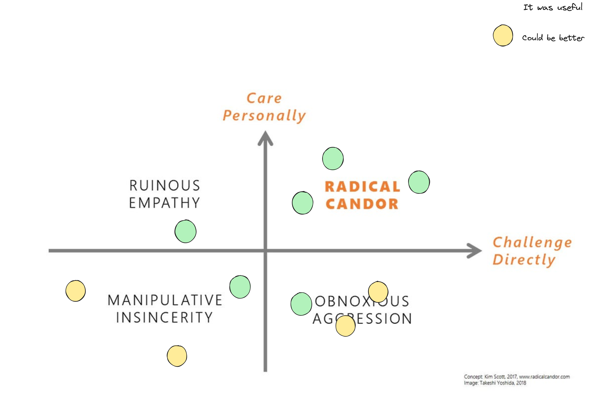

# Radical Candor

- Sometimes you don't need an app to solve a real problem. Sometimes you just need a face-to-face conversation.
- If it's hard to say to someone that he/she has something between his/her teeth, it's even harder to say that he/she it's not doing a good job.
- A leader that put attention in the guys that have more chances to standout are not doing a good job.
    - A team is build by a balance between start and superstars.
        - Super stars are the ones that have a lot of potential, those will be able to lift up the whole team
        - The stars are the ones that are happy with their job, but not accommodated. They are the ones that will keep the team running.
- The good relation between boss and employee is a result of the Silicon Valley culture. There, if you aren't happy with your job, there are a lot of other companies that will be happy to have you.
- Fun Fact: Tim Cook after discovery the Jobs cancer proposed to donate a part of his liver to Jobs.

## Good bosses:

What are the responsibilities of a good boss? They are responsible by the results.

1) Guide the team to the goals of the company.
2) Contract, restructure and keep motivated the right guys for the right job.
3) Harverst the results of the team.

In other words, a good boss is responsible to create + contentment and - insatisfaction.

- Good results come from good relationships. Don't try to extract the best from a team that don't have synergy.
```
Radical Candor = True care about peers + Willingness to challenge them.
```

- Difference between discussion and dialogue. Is your team able to discuss hard topics without getting sad/angry? Good engineers are able to do that!

The radical candor variate from the company, culture, and the person. Adapt your approach before any move.

- direct confrontation for someones may sound like a personal attack. But ANY good thing can be build without a good confrontation of ideas.

- to keep winning you have to criticize the victories. `The problem to live in the top of the mountain is that you can't see the mountain.`


## Knows what motivates each member of the team

- Stars: Be an artist doesn't mean that you want to have a gallery of art. Some coworkers are happy with their functions, they love what they do, and they keeping the wheel spinning.

- Super Starts: They are the ones that have a high ambition, they are building things, proposing, discussing, and they are the ones that will lift up the whole team.

If I say that a member is estable, how this sounds to you? This chapter bring to me a different perpective about the word "estable". I always thought that this word was related to someone that is not ambitious, but this guys are very important to keep everything running. The Goal of the boss is to identify them and keep each one motivated based on their goals and ambitions.

- Try to find some purpose in your work. If you ask for a mason that was responsible to build the São Pedro's Cathedral. The first can say that he was working. The second, helping to raise a wall. The third, building a cathedral. The last one, building a cathedral that will be a reference for the next generations.

- Learnig to tell your story is a good skill to have.

- Promote the wrong guys can trigger a series of problems. Like team discontentment.

# Feedbacks

The boss inherits a lot of assumptions, mainly if it is a new member in the team. The goal of this fella is to conquer the trust of their mates. The feedbacks are the best way to do that.

The feedback, when well done, can propel your career.

- Instead of say: `There is something that a can do to help you?`

- Say: `There is something that I can do to help you? According to our last converstions and the things that you have been claimed, I think that you are having some problems with the X and maybe Y wold be a good idea to fix it`

- Managing reactions to bad feedback

- box of critics: The head of a company realized that at each meeting, his employees did not feel comfortable about the outcomes of the meeting. His idea was to set up an anonymous feedback box and use this as a tool to improve interaction between employees.

- If you are not able to give sincere feedbacks your subordinates won't to

- Give feedbacks with actions. Otherwise, it might sound like a personal attack.
- Give the feedback immediately
- Praise in public criticize in private
    - The praise in public should be done as a way to elevate the barrier of the other ones
- In the criticize chances, don't blame the other by the actions but the outcome that it can generate.
- I think that this is wrong > You are wrong
-  Monitor your feedbacks are the best way to keep them worth and improve it on the long term
- Use the Kim Scoot map as reference. Share it with your subordinates and ask them to choose how was the last interaction.


