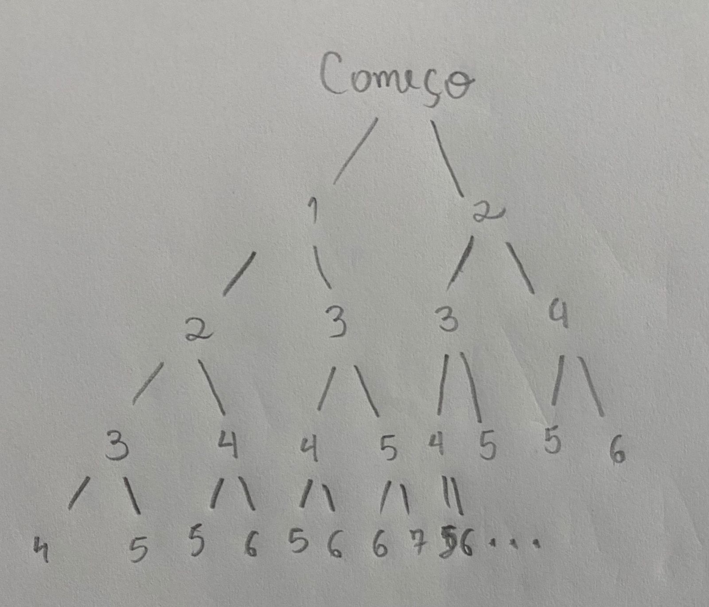
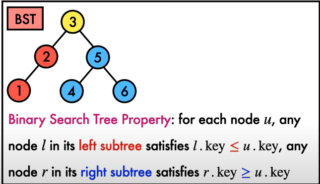
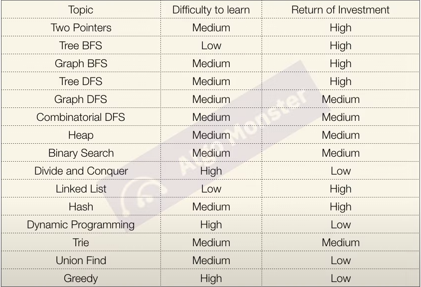

# Principal Topics

- Time Complexity
- Arrays
- Trees
- Heap
- Stack
- Graphs
- Hash Maps

# Why learn this shi*t?

- I don't give a fuck about that in the University, this doesn't mean that I'm completely dumb about the topic, but, I'm not even able to feel comfortable weaving a discussion of it

- As I tried to tease in other's essays: engineering is more than tooling, it is conceptual knowledge. Having a base familiarity with that(DSA), I'm sure that I can glimp different opportunities and be a better engineer

- Creativity it's not about being a creative guy, you need to be exposed to different use cases and theory knowledge to be able to  play around with different topics and connect them, the same could occur with any field, including computing

- It's fun!

In the end, I'm just studying that to be approved for a job interview is pure bullshit, but as I have free time to spend on it, I think that is a good opportunity.

# Algorithms


## Time Complexity


### **Rules**

- Input size is always bigger than zero
- functions do more work for more input
- drop all constants

    - Ignore the constants will not affect the final result, for this reason, to simplify, we will adopt this practice of dropping them

- Care about the big values

# Dynamic Programming

The method used to solve complex problems chunking them into the smallest subproblems, storing these values and using them to solve further problems.

So, the solution of the whole problem is a result of the solution of the subproblems.

- Establish a mathematician relationship between the subproblems and the main problem and use it to solve the whole problem



O exemplo acima é um bem simples sobre como o DP funciona, aqui,estamos tentando encontrar o valor máximo de possibilidades para chegar ao topo(N) dando 1 ou 2 saltos.

Podemos observar alguns pontos importantes:

- Caso o numero de degraus seja 4, podemos observar que todas as possibilidades de chegar ao 4 foram formadas até a altura 3 dessa árvore.
- A complexidade para resolver esse problema deve contemplar todas as possibilidades que estamos tentando formar. Fazendo algumas relações básicas, é simples de observar que isso é 2^n, ou seja, exponencial.
- Agora a parte mais diícil, nos convencermos de que a solução para N=3, é a soma das soluções para N=1 + N=2, ou seja, 3 = 1 + 2.
    - Para N=4, a solução é a soma das soluções para N=2 + N=3, ou seja, 5 = 2 + 3
    - Para N=5, a solução é a soma das soluções para N=3 + N=4, ou seja, 8 = 3 + 5
    - E assim por diante

Sabendo destes pequenos detalhes, podemos aplicar para outros problemas de DP. Entre eles, é comum observar:

- Problemas de maximização ou minimização


Por ser um problema que pode ser resolvido usando recursão, é extremamente imporante pensar em como podemos parar a recursão para ela não se tornar infinita.

Nesse caso, seria quanto o valor de N for 0 ou 1, que são os casos base. E para N < 0.

## Store(Memoization != memorization) also known as Top-Down

A technique to speed up the algorithm by storing the results that were already calculated and using them on future calculations.

The term "memoization" comes from the **Latin** word "memorandum" which means "to remember", and it's confused with "memorization" which means "to memorize".

But both are very similar.

## Bottom-up

Similar to the top-down approach, but instead of using recursion, we use a loop to solve the problem. The tricky is to find the mathematical relationship between the subproblems, but the performance and the memory usage are better.

# Doubly Linked List

- A linked list that has two pointers, one pointing to the next node and the other pointing to the previous node

- Start with a head and a tail

- The tail NEXT points to NULL
- The head PREV pointer points to NULL
- The tail PREV points to the last node or head at the beginning
- The head NEXT points to the first node or tail in the beginning

```go
    type Node struct {
        data, value int
        next, prev *Node // next and prev are just pointer to another node, for this reason, we are using *
    }

    type DoublyLinkedList struct {
        head, tail *Node
    }

    func Constructor() DoublyLinkedList {
        head := &Node{data: 0, value: 0}
        tail := &Node{data: 0, value: 0}
        head.Next = tail
        head.Prev = nil
        tail.Prev = head
        tail.Next = nil
        return DoublyLinkedList{head, tail}
    }

    func main() {
        list := Constructor()
        fmt.Println(list)
    }
```


### Resource [Doubly Linked List](https://www.codecademy.com/article/doubly-linked-list-conceptual)


# Linked Lists

## Introduction

Try to fix a lack of arrays, that is: **It was designed to be always the right size**

**Components**

- Node: Have two pieces of information
    - pointer, that we call **next**
    - **data**, information that we decided to save on it
- The last node points to **NULL**
- The first component of a linked list is called HEAD

# Queue

- Linear data structure
- Flexible size
- FIFO, first in first out

```go
type Queue struct {
    items []int
}

// inserting the element at the end of the queue
func (q *Queue) Enqueue(i int) {
    q.items = append(q.items, i)
}

// removing the first element of the queue
func (q *Queue) Dequeue() int {
    toRemove := q.items[0]
    q.items = q.items[1:] // removing the first element, that will be always the [0]
    return toRemove
}

// returning the first element of the queue
func (q *Queue) Peek() int {
    return q.items[0]
}
```

# Stack

- Last in, first out

```go
type Stack struct {
    items []int
}

func (s *Stack) Push(i int) {
    s.items = append(s.items, i)
}

func (s *Stack) Pop() int {
    toRemove := s.items[len(s.items)-1]
    s.items = s.items[:len(s.items)-1]
    return toRemove
}

func (s *Stack) Top() int {
    return s.items[len(s.items)-1]
}
```


## Monotonic Stack

Used to solve problems that require finding the next greater element in an array and reduce the time complexity to O(N).

# Backtracking

I think that it's a good idea to think about back tracking as a permutation of elements with some constraints that will be applied to the solution and consecutively, will reduce the number of possibilities.

Can be solved using recursion. And as usual, the base case and the constraints are the most important part of the solution.

## Good Exercises to think about it

[LeetCode generate parentheses](https://leetcode.com/problems/generate-parentheses/)

In the exercise, we can start to think about generating all the possibilities, and validate if they are correct or not.

The other way is to think about the constraints and the base case

> Where I'm able to put a new open parenthesis?

If N=3, this means that I can put a maximum of 3 open parentheses, in other others open < 3

> Where I'm able to put a new close parenthesis?

If I have 1 open parenthesis, I can put 1 close parenthesis;
If I have 2 open parenthesis, I can put 2 close parenthesis;
If I have 0 open parenthesis, I can't put a close parenthesis

in other words, close < open

**the base case is when open == close == n**

Problem solved!

# Trees

## Binary Search Trees(BSTs)

**Obs:** the difference between a binary tree and a binary search tree is that the binary search follows some rules, that are explained ahead.

Binary means two, so nodes in a binary tree have a maximum of **two children**

Avg. case: search, insert, delete -> O(log(N))

**BST Property:**

For each node u, any lode l in **its left subtree** satisfies l.key <= u.key, and any node r in its **right subtree** satisfies r.key >= u.key



## Tree traversals
Unlike linear data structures like arrays, linked lists, queues and stacks, which have only one logical way to traverse them, trees can be traversed in different ways.

A traversal algorithm aims to "process" **each node in the tree exactly once**

We have 2 types of traversal algorithms in tress, that are: **Depth First Search or DFS** & Level Order Traversal or **Breadth First Search or BFS**

DFS(As the name suggests, start from the depth point of the tree):

Obs: The results presented, will be on top of the above image tree.

**inorder:**
[1,2 3, 4, 5, 6]

```python
def inorder(u):
    if u:
        inorder(u.left)
        print(u.key)
        inorder(u.right)
```

**preorder:**
[1,2,3, 5, 4, 6]

```python
def preorder(u):
        if u is not None:
            print(u.key)
            preorder(u.left)
            preorder(u.right)
```

**postorder:**
[1,2,4,6,5,3]

```python
    def postorder(u):
        if us is not None:
            postorder(u.left)
            postorder(u.right)
            print(u.key)
```

## Minimum/Maximum O(h):

Minimum/Max: The logic behind those algorithms is the following: The min value will be in the last element of the left and the same for the Maximum, but to the right

## Search O(h)
TODO
## Insertion
TODO
## Deletion
TODO

## Perils and Advantages

**Advantages:**

- Tree offers Efficient search depending on the type of tree, with an average **search** time of O(log(N))
Trees provide a hierarchical representation of data, making it easy to organize and navigate large amounts of information
- The recursive nature of trees makes them easy to **traverse and manipulate**

**Perils:**

- Unbalanced trees, meaning that the height of the tree is skewed towards one side, which can lead to inefficient search times
- Trees demand more memory space
- The implementation and manipulation of trees can be complex and require a good understanding of the underlying algorithms


## Resources

- [Binary Search Trees: Samuel's tutorial](https://www.youtube.com/watch?v=0woI8l0ZWmA)
- [All you need to know about tree data structure](https://www.freecodecamp.org/news/all-you-need-to-know-about-tree-data-structures-bceacb85490c/)

# Arrays

Arrays are one of the basic structures in computer science and one of the most used. Here I will try to cover some of the most important techniques and algorithms that we can use to solve problems.

## Sliding Window

## Types

- Fixed Size
- Dynamic Size

## Two Pointers

## Sorting

## Circular array

This is a simple approach to solving problems that involve circular arrays.

It's important to notice the following math operation around the module:

- 1 % 5 = 1
- 2 % 3 = 2

If the divided is smaller than the divisor, the result will be the divided.

So, if we have a circular array with 5 elements, and we want to access the 6th element, we can do the following:

```go
n := len(arr)
for i := 0; i < n; i++ {
    fmt.Println(arr[i % n])
}
```

# Binary Search

A visual representation

0. [2,3,3,4,6,7,8,9] | **target=7**
1. [6,7,8,9] | **target=7**
2. [6,7] | **target=7**
3. [7] | **target=7*

An important detail about binary search is defining if we are trying to say if the element exists or returning it index. Depending on the question, this could change, according to the array and the way that we implement it. We could have different outputs! Let's see an example:


A normal Binary search, [like this one](https://github.com/perebaj/playground/blob/main/leetcode/binary-search/main.go), for this input:

- [1,2,2,2,2,2,2,4,4,5,6].

Will return the following index:

- 5

That is true, but we can improve this implementation to return the first occurrence of the element, or the last one. This is very important to understand, and before jumping into the code, let's build a visual representation.

[1,2,2,2,2,2,2,4,4,5,6]. Using the same array. Let's say that we are trying to find 2;


[T, F, F, F, F, F, F, F, F, F, F] | **target=2**

the values are True or False, if **<2**, will be **false**, otherwise, will be **true**.

This could be used to find the first occurrence. And we can use a similar representation to find the last.

[T, T, T, T, T, T, T, F, F, F, F] | **target=2**

In both cases, the first occurrence of **F** will be our answer. If there isn't any **F**, the element should occupy the last position or the first one, depending on the case.

Using this algorithm you need to have in mind that you are looking for the **false value**. So, if you find a true value in the middle, then you can iterate to the middle + 1, otherwise, you just assign the right value to the middle, because the current **false value could be the answer.**

Something like that:

```
if nums[mid] < target // true case {
    left = mid + 1
} else {
    right = mid
}

```

# Resources
- [Array CheatSheet](https://www.techinterviewhandbook.org/algorithms/array/)

- [Solve subarray problems FASTER (using sliding window)](https://www.youtube.com/watch?v=GcW4mgmgSbw)

# Difficulty to learn x Recompensation



# Algorithms a visual introduction

[Top 7 Algorithms](https://www.youtube.com/watch?v=kp3fCihUXEg)

These include:

- Binary Search: **Try to find a specific value in a sorted array**
- Depth-First Search:
- Breadth-First Search
- Merge Sort
- Quick Sort
- Greedy

# General Important Resources

- [Data Structures](https://www.youtube.com/playlist?list=PLpPXw4zFa0uKKhaSz87IowJnOTzh9tiBk)
- [DSA Handbook](https://www.techinterviewhandbook.org/)
- [Leetcode questions with resolution 75](https://docs.google.com/spreadsheets/d/1A2PaQKcdwO_lwxz9bAnxXnIQayCouZP6d-ENrBz_NXc/edit#gid=0)
