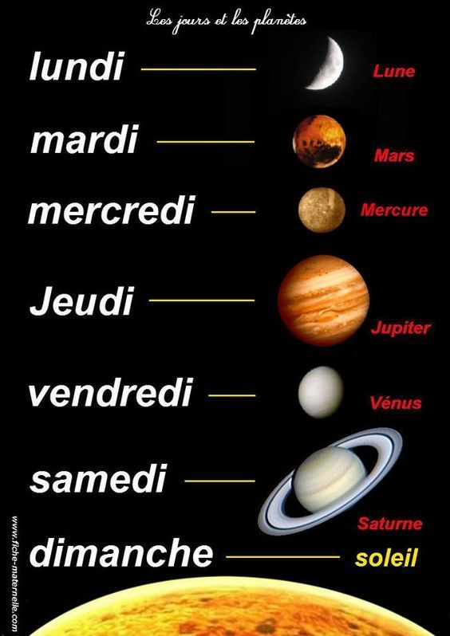

# French

Colors:

- Rouge
- Bleu
- Blanc
- Vert
- Jaune
- Orange
- Violet
- Rose
- Marron
- Noir

How to ask: "How do you call this?" - Comment ça s'appelle?

- Bird | Oiseau
- Owe | Hibou
- Butterfly | Papillon
- Pasta | Pâtes
- Delicius | Délicieux

tondre le pelouse/gazon - mown the lawn

- fish | poisson
- faca | couteau
- Batata | pomme de terre
- Panela | casserole

# Pronunciation

## Vowels

## Consonants

Final consonants, especially the plural -s and -x, are usually

silent: papiers [papeeyay], papers; morceaux [morsoh], pieces.

There are four exceptions to this rule: -c, -f, -l and -r: sac, [sak],
bag; tarif [tareef], fare; appel [ahpel], call; hiver [eevair]. (A simple mnemonic, CaReFuL, is a good way to remember these voiced consonants.)

# Lesson 1

1 – Bonjour Jeanne, comment‿allez-vous  ?
2 – Bien, et vous ?
3 – Ça va très bien, merci.
4 Je vous présente ma fille, Chloé.
5 – Bonjour, Chloé. Comment ça va ?

## Commant allez vous?

allez comes from the irregular verb aller, to go, the verb can be used to ask how someone is doing, health or well-being.

- va is the third person singular of aller(he, she, it)

- présenter: to present but in this context it means **to introduce**. Je vous présente

- Commant ça va? How are you doing? is equivalent to Comment allez-vous?, but slightly more familiar.

# 23/01/2025

allons-y on commence = Vamos começar!
Y-ee-grek
Comment épelez-vous nom = Como você soletra seu nome?
Comment épeules-tu ton nom? = Como você soletra seu nome?
mur = parede
nuit = noite
règle = regra
étudiant = estudante
bébé = bebê
manteau = casaco
crayon = lapis = giz de cera = a mesma palavra em ingles

## Salutations

bonjour
bon après-midi = boa tarde
à bientôt = até logo
à plus tard = até mais tarde
à tout à l`heure = até mais tarde = a toutaleur
de rien = de nada
bonne chance = boa sorte

# 28/01/2025

Frances com mademoiselle

- Mot = palavra
- Tout = tudo
- d'accord = ok
- d'abord = primeiro
- perd = perde
- Oiseaux = pássaros
- Beaucoup = muito
- Coup = golpe
- Loup = lobo
- Chez = casa
- Assez = bastante/Muito
- Absolu = Absoluto
- trac = medo

- o e sem acento a gente quase n pronuncia

- égalment = igualmente
- père = pai
- mère = mãe

a + i = é

e + u

é tudo an para os fonemas nasais

- Gn som de nh
- bonne chance = boa sorte

# 04/02/2025

Je m;appelle = Meu nome é

Je appelle = Me chamo
Tu appelle = Você chama
Il appelle = Ele chama
Elle appelle = Ela chama
Nous appelons = Nós chamamos
Vous appelez = Vocês chamam
Ils appellent = Eles chamam
Elles appellent = Elas chamam

O que é um verbo reflexivo?

- Um verbo reflexivo é um verbo que é acompanhado por um pronome reflexivo. O pronome reflexivo concorda com o sujeito e indica que a ação do verbo é realizada pelo sujeito e retorna ao sujeito. Em francês, os verbos reflexivos são conjugados com o pronome reflexivo correspondente ao sujeito.

Comment vous appelez-vous? = Como você se chama?

ai é o a aberto

Avoir = ter

j'ai
tu as
il a
elle a
nous avons
vous avez
ils ont
elles ont

être = ser ou estar

je suis
tu es
il est
elle est
nous sommes
vous êtes
ils sont
elles sont

aujourd'hui = hoje
hier = ontem
lui = ele
elle = ela
encore = ainda

Tu a compris? = Você entendeu?

No passado é usado como auxiliar o verbo avoir

Vous avez un rendez-vous? = Você tem um compromisso?

- Se começa com a é tudo da conjugação ter

Elle e chanteuse, elle a une belle voix = Ela é cantora, ela tem uma bela voz

Il e americain, il a trente ans = Ele é americano, ele tem trinta anos

Les nombres = Os números

un = um
deux = dois
trois = três
quatre = quatro
cinq = cinco
six = seis
sept = sete
huit = oito
neuf = nove
dix = dez
onze = onze
douze = doze
treize = treze
quatorze = quatorze
quinze = quinze
seize = dezesseis
dix-sept = dezessete
dix-huit = dezoito
dix-neuf = dezenove
vingt = vinte
vingt et un = vinte e um

30 = trente
50 = cinquante = cínkant
60 = soixante-dix
70 = soixante-dix
80 = quatre-vingts
90 = quatre-vingt-dix

dias da semana

lundi = segunda-feira = lune
mardi = terça-feira = marte
mercredi = quarta-feira = mercure
jeudi = quinta-feira = Jupiter
vendredi = sexta-feira = Venus
samedi = sábado Saturno
dimanche = domingo Sol

# Material

https://www.languageguide.org/franc%C3%AAs/n%C3%BAmeros/

# Proxima aula

- vamos praticar os números
- verbos no presente

# 11/02/2025

- été = verão
- musée = museu
- nager = nadar
- paquet = pacote
- parlez = falar
- pied = pé
- clef = chave
- fête = festa
- être = ser
- français = francês = Francé
- chlore = cloro
- école = escola
- autre = outro = autr
- choux = repolho
- plein = cheio
- manteau = casaco

Comment on dit en français le 19:

dix-neuf

vous est en retard = você está atrasado

c'est la Grand Place = Ali é a grand place
c'est Mario

13/03/2025

speak = parler

je parle
tu parles
il/elle parle
nous parlonsaimer
vous parlez
ils/elles parlent

visit

je visite
tu visites
il visite
nous visitons
vous visitez
ils/elles

aime
avoir
s'appeler
habiter/live

je ha

manger

Je mange
Tu manges = comer
nourrir = alimentar

verbo ir

- je vais
- tu vas
- il/ elle va
- vous allez
- nous allons
- ils/elles vont

faire = fazer

Quel âge tu as?
c'est super!
Vous pouvez répéter?/ Tu peux répéter?
Comment ça se  prononce? Como se pronuncia
sac-à-dos
le cahier
drôle = engraçado
un soeur ? uma irmã | seeRr
chien = cachorro
le chat = o gato
frere = irmão
voiture = carro
je vais magasiner caque jour = eu vou para revistaria todo dia
il au stade chaque lundi =
cottage = casinha/cabana/chalé
choses bizarre = coisas bizarras
est que vous faites des gateaux?

# 27/03

# Un jour est composé d'une jornée et d'une nuit
# Les Jours = Os dias

jour = jornada
1 journée = 12 heures

quando eu chego = quand j'arrive

bonjour = bom dia
bonsoir = boa noite

quando eu saio = quand je pars

bonne journée = bom dia (Quando você se despede de alguém pela manhã)
bonne soirée = boa noite (Quando você se despede de alguém pela noite)

bonne nuit = boa noite (Quando você deseja uma boa noite de sono)

Se situer dans le temps

avant = antes

Il fait ses devoirs avant de diner = Ele faz a lição de casa antes de jantar

pedant = durante

On ne doit pas parler pendant le cours = Não devemos falar durante a aula

On pode ser nos ou a gente. é o nous impessoal.

* Il também pode ser usado como impessoal. No portugues a gente pode omitir o pronome/sujeito. No frances é obrigatório.

après = depois

Après les vacances, il faut reprendre le travail = Depois das férias, é preciso voltar ao trabalho

- à tes souhaits = saúde
- à tes amours = amor

Chaque matin je me lève à 8h = Toda manhã eu me levanto às 8h

se lever = verbo nominal. Para descrever algo que eu ƒaço comigo mesmo

Chaque jour je vais à l'école = Todos os dias eu vou para a escola
Chaque semaine je une série tv = Toda semana eu assisto uma série de tv
Tous les jours je prends ma duche = Todos os dias eu tomo banho

* prende = tomar igual no portugues
    * prendre un café = tomar um café
    * eu vou pegar meu celular = je vais prendre mon téléphone
    * prendre un bain = tomar um banho

Toutes le semaines je fais les courses = Todas as semanas eu faço compras
D'habitude = Normalmente = Geralmente não pronunciamos o E, mas até a ultima letra. Nesse caso o D fica mais forte
En général = Em geral
Souvent = frequentemente
Vers 11 heures = Por volta das 11 horas (aproximadamente)
Toujours = sempre
tous les jours = todos os dias

Aller = ir

je vais
tu vas
il/elle va
nous allons
vous allez
ils/elles vont

Aujourd'hui = hoje. Pronuncia: ojurdí
Hier = ontem
Demain = amanhã
Cette semaine = essa semana
Ce mois = esse mês
Le mois prochain = o próximo mês. Pronuncia até o ai
L'année prochaine = o próximo ano. Pronuncia o `n` é nasal

- jamais = nunca/jamais
- rarement = raramente = pronuncia: raromã
- parfois = às vezes = pronuncia: parfua
- quelquefois = às vezes = pronuncia: quelqufua

me réveille. Pronuncia: me revéi. Despertar
