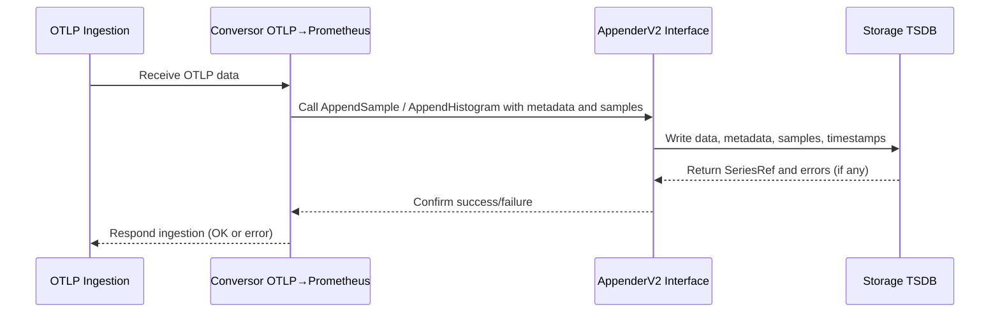
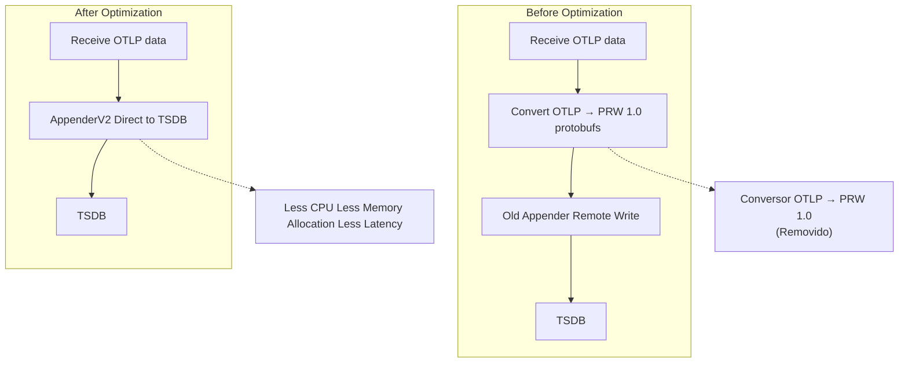

# Native Summaries Notes

Original Issue: https://github.com/prometheus/prometheus/issues/16949

Summaries in Prometheus are a metric type used to calculate and expose quantiles (percentiles) over a sliding time window. Classic summaries are built from multiple counter series that track total count, sum, and quantile values. The proposed "native summaries" aim to replace these classic summaries by representing the summary as a single more efficient series that is transactional, similar to how "native histograms" are handled.

Histograms and summaries both measure distributions but differ in how they store and expose data:

Histograms bucket observations into predefined ranges (buckets) and keep counts per bucket, plus a total count and sum, allowing calculation of approximate quantiles by aggregating buckets.
Summaries directly calculate and expose quantiles (like median, 90th percentile) without defining buckets.

## **Differences:**

* Classic summaries store quantiles as floating-point labels with separate series; native summaries would store quantiles natively in a single series.

* Native histograms provide exponential bucketing and sparsity, while native summaries are planned with explicitly set quantiles only (no automatic quantiles like exponential buckets).

* 🚨Observations: Summaries tend to be less recommended in practice now due to native histograms🚨

# **Key points of the issue:**

* There are discussions about code maintenance challenges due to duplicated code (switch statements) around native histograms that, maybe, should be addressed before adding native summaries.
* There is a visionary discussion about potentially merging histograms and summaries into a unified "distribution" metric type that could have both buckets and pre-calculated quantiles, improving flexibility and implementation.
  * Challenges include how to expose and aggregate quantiles and buckets in a single sample, and compatibility with existing standards like OpenMetrics, which deliberately keep histograms and summaries distinct.
  * The unified type would improve usage consistency and simplify both storage and query logic, while making it possible to choose, per use case, if only buckets, only quantiles, or both are needed. (need to validate this idea/feasibility @perebaj)

# **Turn Summaries into a sub-type of Histograms**

> IIRC OpenMetrics kept summaries and histograms deliberately distinct, even regulating that there can be quantile-less summaries, but not bucket-less histograms (but the latter might just be because of the redundant +Inf bucket). So maybe there are good reasons for keeping them separate that I don't see right now.
>
> Beorn7 comment
>

Jojo note: This sounds like a interesting idea, this because, the performance of the new native histograms was already comproved to be better. As defined above, summaries and histograms are similar, with the difference that summaries expose quantiles directly, while histograms expose buckets that can be used to approximate quantiles. So, if we can have a single type that can do both, it would be great.

If you want to have all quantiles, set the "Native Histogram" to "scrape" everything, otherwise, if you want to have only some quantiles, set the "Native Summary" to "scrape" only those quantiles. (Obs: This is just an idea, not sure if it is feasible).

Reference: https://www.tigerdata.com/blog/four-types-prometheus-metrics-to-collect#summaries ⬆️

> Summaries provide more accurate quantiles than histograms, but those quantiles have three main drawbacks:
>
> 1. computing the quantiles is expensive on the client side. This is because the client library must keep a sorted list of data points over time to make this calculation.
> 2. the quantiles you want to query must be predefined by the client. Only the quantiles for which there is a metric already provided can be returned by queries. There is no way to calculate other quantiles at query time.
> 3. It’s impossible to aggregate summaries across multiple series, making them useless for most use cases in dynamic modern systems where you are interested in the view across all instances of a given component.

**Observation about 3:**

The afirmation refers to the impossibility of calculating an aggregated quantile (e.g., global p99) over multiple summary-type series in Prometheus, which is crucial in dynamic and distributed environments.

Practical example: Why are summaries not aggregable?
Imagine you have an "add_product" service running on 3 instances (behind a load balancer):

Instance	p99 (summary)
host1.domain.com	400ms
host2.domain.com	200ms
host3.domain.com	250ms
Each summary calculates its own p99 locally, using only the requests that arrived at that instance.

What happens if you want the global p99?
There is no mathematically correct way to take "400ms, 200ms, and 250ms" (the p99s from each host) and calculate the p99 of all requests together.

If you average, take the minimum or maximum of these values, it doesn't mean the result is the real global p99.

Example: suppose host1 received 10k reqs, host2 only 100, and host3 1.000 — each p99 reflects very different populations!

Jojo Note: For this reason, summaries are considered "useless for most use cases in modern systems": in environments with multiple instances (containers, cloud, autoscaling...), it is only possible to know the quantile of each instance, but not that of the sum of all.

## Relation and Difference between Buckets and Quantiles

**Buckets (Histograms)**
Buckets are numerical intervals defined in a histogram metric.
Each bucket counts how many events fell into it (i.e., how many events are less than or equal to its upper bound).

For example, if the buckets are [0.5, 1, 2, +Inf], a bucket of 1 counts how many observations are less than or equal to 1.

The histogram, therefore, does not calculate quantiles directly — it only stores the cumulative count, per bucket, of the observed events.

**Quantis (Summaries or calculated via buckets)**

A quantile (p.ex. p95) represents the value below which a certain percentage of observations occur.

Quantiles are typically calculated from the distribution of individual values.

In a histogram, the quantile is estimated: you see which buckets the desired percentile falls into, and interpolate between the lower and upper bounds of the bucket to estimate that value.

In a summary, the quantile can be calculated exactly (via algorithms in the client library), but it is not aggregable across instances.

**Jojo Note:**

Buckets ≠ Quantiles
Buckets only store ranges and counts; quantiles are statistical positions (percentiles).

The quantile value usually does not fall exactly into any bucket; it is calculated "inside" (by interpolation) a bucket, using the counts of the surrounding buckets.

By increasing the number of buckets near the value of interest, the accuracy of the quantile estimate increases, but it is never exact, only an approximation.

OpenMetrics Documentation
A histogram needs at least ONE bucket, but this only refers to the aggregation of values – not to the direct calculation of quantiles.

A summary may not provide quantiles, but if it does, it returns the exact value for the chosen quantile (because the calculation or its algorithm is done on the exporter side).

Therefore: Buckets are raw material, quantiles are the statistical result that can be estimated — but they are not equivalent. A bucket is not a quantile. In OpenMetrics (and Prometheus), buckets are predefined intervals to group how many observations fall below certain values. A quantile (like p95 or p99) represents a specific point in the distribution (for example, the value below which 95% of observations occurred).

# **Stricter Type System**

In Prometheus today, a single time series can switch types over time. For example, a series might store simple float values, then switch to a native histogram type (NH), or switch between counter histograms and gauge histograms. (I'm not sure if I understand this correctly - need to verify.🧐)

> This created a lot of complications in the code because we have to deal with those mixed-type series in storage and querying. It even affects the user because PromQL functions need to have defined behavior for acting on the different types
>  Beorn7 comment

> The "statically typed" approach would be to make the type part of the series's identity, thereby avoiding mixed type series. (However, this would not apply to mix of integer and float histograms...
> Beorn7 comment

* Dynamic typing — what does that mean? It seems there is nothing official about it in the documentation ([Metric Types](https://prometheus.io/docs/concepts/metric_types/) or [Data Model](https://prometheus.io/docs/concepts/data_model/)).

Each sample in Prometheus carries a numeric value (float), but with the introduction of native types such as Native Histograms, the internal structure of samples can vary.

**Jojo Note:**

Seems that here we are talking about other internal problem that was introduced when the new native type was added. And we, maybe, should take care of this shennanigans before adding a new native type (native summaries).

# Appender V2 Notes

Other related Issues:

- [Simplify TSDB Appender interface #11764](https://github.com/prometheus/prometheus/issues/11764)

feat(storage): add new appender interface and compatibility layer #17104

https://github.com/prometheus/prometheus/pull/17104

A new AppenderV2 interface has been proposed for Prometheus TSDB, representing a significant architectural improvement over the existing 9-method Appender interface. This consolidated approach combines metadata, exemplars, and created timestamps into unified append operations, delivering substantial performance gains while enabling direct OTLP ingestion without intermediate Protocol Buffer translation steps.

Initial benchmarks demonstrate impressive performance improvements: 36% reduction in CPU usage, 38% fewer bytes allocated, and 19% fewer allocations.

[Reference that comprove this numbers](https://github.com/prometheus/prometheus/pull/16951)

## Proposal - TSDB Support for Cumulative CT (and Delta ST on the way) #60

[proposal: TSDB Support for Cumulative CT (and Delta ST on the way) #60](https://github.com/prometheus/proposals/pull/60)

# Sharding

Sharding refers to splitting the responsibility of scraping and storing metrics across multiple instances, enabling greater scalability and reliability in large environments.

## Why:

Sharding solves two main problems

1. Scalability:

By distributing the workload across multiple instances, the server can handle larger volumes of metrics without reaching scalability limits.

2. High Availability:

In case of failure in one instance, the other instances can continue to scrape and store metrics, ensuring high availability.

# Spareness(underutilization)

Means that not all shards are used at the same time or equally loaded, in other words, underutilization of the resources.

# Spareness in metrics

Spareness means that many parts of a metric are empty. This can happen if the values are not spread out evenly, or if the metric has too many small parts.

In the case of histograms, extesively spares buckets can "leak" storage and memory, as each bucket, even unused ones, requires space to be allocated.

Reference: https://docs.google.com/document/d/1cLNv3aufPZb3fNfaJgdaRBZsInZKKIHo9E6HinJVbpM/edit?tab=t.0#heading=h.2ywoyp13c0bx

Reference 2: https://grafana.com/blog/2021/11/03/how-sparse-histograms-can-improve-efficiency-precision-and-mergeability-in-prometheus-tsdb/