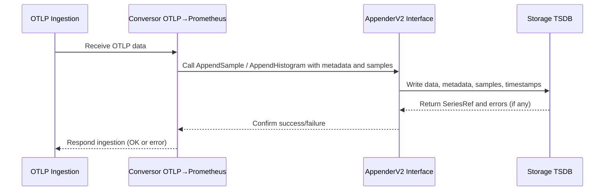

# Native Summaries Notes

Original Issue: https://github.com/prometheus/prometheus/issues/16949

Summaries in Prometheus are a metric type used to calculate and expose quantiles (percentiles) over a sliding time window. Classic summaries are built from multiple counter series that track total count, sum, and quantile values. The proposed "native summaries" aim to replace these classic summaries by representing the summary as a single more efficient series that is transactional, similar to how "native histograms" are handled.

Histograms and summaries both measure distributions but differ in how they store and expose data:

Histograms bucket observations into predefined ranges (buckets) and keep counts per bucket, plus a total count and sum, allowing calculation of approximate quantiles by aggregating buckets.
Summaries directly calculate and expose quantiles (like median, 90th percentile) without defining buckets.

**Differences:**

* Classic summaries store quantiles as floating-point labels with separate series; native summaries would store quantiles natively in a single series.

* Native histograms provide exponential bucketing and sparsity, while native summaries are planned with explicitly set quantiles only (no automatic quantiles like exponential buckets).

* 🚨Observations: Summaries tend to be less recommended in practice now due to native histograms🚨

**Key points of the issue:**

* There are discussions about code maintenance challenges due to duplicated code (switch statements) around native histograms that should be addressed before adding native summaries.
* There is a visionary discussion about potentially merging histograms and summaries into a unified "distribution" metric type that could have both buckets and pre-calculated quantiles, improving flexibility and implementation.
* Challenges include how to expose and aggregate quantiles and buckets in a single sample, and compatibility with existing standards like OpenMetrics, which deliberately keep histograms and summaries distinct.
* The unified type would improve usage consistency and simplify both storage and query logic, while making it possible to choose, per use case, if only buckets, only quantiles, or both are needed.

**Turn Summaries into a sub-type of Histograms**

> IIRC OpenMetrics kept summaries and histograms deliberately distinct, even regulating that there can be quantile-less summaries, but not bucket-less histograms (but the latter might just be because of the redundant +Inf bucket). So maybe there are good reasons for keeping them separate that I don't see right now.
>
> Beorn7 comment
>

The comment about makes me think about the feasibility of having a single type that can do both, histograms and summaries.

Jojo note: This sounds like a interesting idea, this because, the performance of the new native histograms was already comproved to be better. As defined above, summaries and histograms are similar, with the difference that summaries expose quantiles directly, while histograms expose buckets that can be used to approximate quantiles. So, if we can have a single type that can do both, it would be great.

If you want to have all quantiles, set the "Native Histogram" to "scrape" everything, otherwise, if you want to have only some quantiles, set the "Native Summary" to "scrape" only those quantiles. (Obs: This is just an idea, not sure if it is feasible).

**Stricter Type System**

In Prometheus today, a single time series can switch types over time. For example, a series might store simple float values, then switch to a native histogram type (NH), or switch between counter histograms and gauge histograms. (I'm not sure if I understand this correctly - need to verify.🧐)

> This created a lot of complications in the code because we have to deal with those mixed-type series in storage and querying. It even affects the user because PromQL functions need to have defined behavior for acting on the different types
>  Beorn7 comment

> The "statically typed" approach would be to make the type part of the series's identity, thereby avoiding mixed type series. (However, this would not apply to mix of integer and float histograms...
> Beorn7 comment

* Dynamic typing — what does that mean? It seems there is nothing official about it in the documentation ([Metric Types](https://prometheus.io/docs/concepts/metric_types/) or [Data Model](https://prometheus.io/docs/concepts/data_model/)).

Each sample in Prometheus carries a numeric value (float), but with the introduction of native types such as Native Histograms, the internal structure of samples can vary.

**Jojo Note:**

Seems that here we are talking about other internal problem that was introduced when the new native type was added. And we, maybe, should take care of this shennanigans before adding a new native type (native summaries).

# Appender V2 Notes

