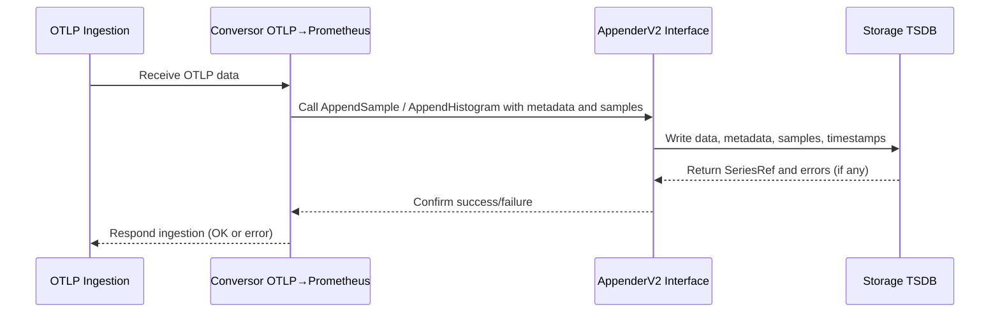

```mermaid
sequenceDiagram
    participant OTLP as OTLP Ingestion
    participant Converter as Conversor OTLP→Prometheus
    participant AppenderV2 as AppenderV2 Interface
    participant Storage as Storage TSDB

    OTLP->>Converter: Receive OTLP data
    Converter->>AppenderV2: Call AppendSample / AppendHistogram with metadata and samples
    AppenderV2->>Storage: Write data, metadata, samples, timestamps
    Storage-->>AppenderV2: Return SeriesRef and errors (if any)
    AppenderV2-->>Converter: Confirm success/failure
    Converter-->>OTLP: Respond ingestion (OK or error)

```