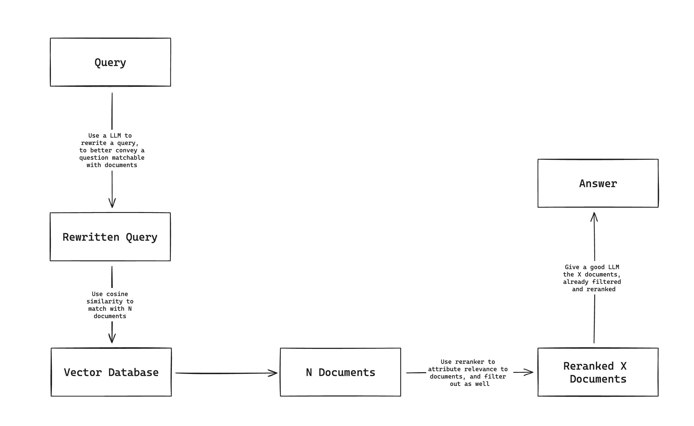

# RAG or Retrieval Augmented Generation

Retrieval augmented generation (RAG) is a strategy that helps address both LLM hallucinations and out-of-date training data.

LLMs extrapolates when facts aren't available, so they confidently make false but plausible statements.

For example, if you ask for a LLM model what is RAG, the answer could be different meanings of the word RAG, like:

- Red, Amber, Green
- Resouce Allocation Graph
- Random Access Generator

# Important Resources

- [Amazon Bedrock workshop - Knowledge Bases and RAG](https://catalog.us-east-1.prod.workshops.aws/workshops/a4bdb007-5600-4368-81c5-ff5b4154f518/en-US/120-rag)
- [Lessons Learned on LLM RAG Solutions](https://www.youtube.com/watch?v=Y9qn4XGH1TI&ab_channel=Prolego)
    - Chunk the documents to better handle the hallucination problem
    - Parse data using some library that will map the data to a useful data structure without losing the meaning
        - Turn the data into a flat structure
    - Isn't too good to squeeze the data using very small chunks, or even a too broad chunk, think of a structure that would be useful for the model, for example, a paragraph.
    - Where you should invest your time:
        The retrieval part is the most important
- [LlamaIndex Webinar: Graph Databases, Knowledge Graphs, and RAG with Wey (NebulaGraph)](https://www.youtube.com/watch?v=bPoNCkjDmco&ab_channel=LlamaIndex)
    - NebulaGraph
        - What is a graph?
            - Sandbrige problem
        - Knowledge Graph
            - Refined and Concise form of data
            - Fine-grained Segmentation
            - Interconnected-structure
        - Entities and Terms for each chunk of data that can be connected
    - Overview of Graph Stores in LlamaIndex
- [LlamaIndex Webinar: Make RAG Production-Ready](https://www.youtube.com/watch?v=Zj5RCweUHIk&ab_channel=LlamaIndex)
    - the retrieval part(context) is the most important. You can follow some well-known strategies like:
        - embedding
        - keywords
        - hybrid
    - ReRanking: When you have a huge amount of files, and and to fill your LLM with this context, you can use re-ranking techniques to select the files/text that have the most accurate information.
