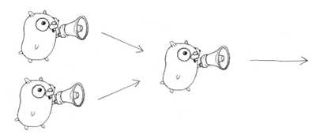

# [Go Concurrency Patterns](https://www.youtube.com/watch?v=f6kdp27TYZs)

**History**

> Go cuncurrency model isn't new, it comes from Hoare's CSP in 1978 and even Dijkstra(1975)

**Gourotines**

- It's not a thread
- It has its own call stack, which grows and shrinks(decrease) as required
- It's very cheap. It's practical to ahve thousands, even hundreds of thousands of it
- There might be only one thread in a program with thousands of goroutines

**Buffered channels**

- Buffering removes synchrinization

**Paterns**


- 08:33 What is a goroutine ?
- 10:17 Channel
- 13:13 Buffered Channel
- 13:50 Go approach to concurrency
- 14:27 Generator Pattern (return Channel)
- 16:58 Multiplexing 2 Channels
- 20:13 Select statement
- 22:47 Time out using Select
- 24:26 Quit using Select
- 26:28 Daisy chain
- 29:26 Google search example
- 37:34 Don't over do ; keep it simple
- 39:08 Conclusion

What is concurrency?

> Concurrency is the compositions of independtly executing computations

```
  Concurrency is a model for software constructions
  > Easy to understand
  > Easy to use
  > Easy to reason about
```

**Obs:** Channels can also be created with a buffer

Buffering removes synchronization

## Patterns Generator
Functions that return a channel

## Multiplexing(fan-in)

## Select statement

A control structure that control the behavior of your program, based on what communications are able to deal at the moment.

What happen is that you try to evaluate which channel is able to designate an action, and then it blocks the channel.

## Timeout using select
Returns a channel that blocks for specified duration

## Quit Channel(Determinist approach)

Use a channel that determines when the process is done

**Obs:** All this patterns could be find in my [playground repository](https://github.com/perebaj/playground)
