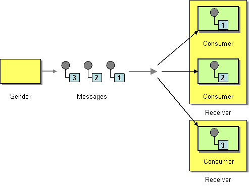

# [Event Driven Patterns](https://newsletter.systemdesigncodex.com/p/3-interview-questions-on-event-driven?ref=dailydev)

Sometimes I'm using those things and don't even think about them.

1) Competing consumer pattern

```
The competing consumers pattern, shown in Figure, enables multiple consumers to pull messages from the same queue, with the guarantee that each message is consumed once only. This pattern can be used to replace serial message processing with concurrent message processing (bringing a corresponding reduction in response latency).
```



The scenario is that you have one queue and multiple consumers. How we can ensure that each message is processed by only one consumer? Usually the own queue implementation handles this. But there are some design patterns under the hood. Like:

- Limit the number of messages that can be processed concurrently.
- Hide a message from the queue until the consumer finishes processing it.
- Use a lock to ensure that only one consumer can process a message at a time.

2) Retry Message Pattern

The main queue brings in each message some important metadata. Like the number of retries, the time to live, the exponential backoff time, etc. The retry message pattern is about how to handle messages that failed and how to create mechanisms to not lose them and not overload the system.

3) Async Request Response Pattern

Your system isn't able to deal with synchronous requests, they take a lot of time what turns impossible to deal with everything in a synchronous way. The solution is to communicate using asynchronous messages. But the initial service, that triggered the request, needs to know the response to tell the user what happened. How to deal with this? The async request response pattern is about how to deal with this situation.

The simplest way is to create a correlation id. The initial service sends a message with a correlation id and the service that will process the request sends a message with the same correlation id. The last service will send the response to the initial service using the correlation id and you can use a DB to store the correlation id and create the relationship between the request and the response.
