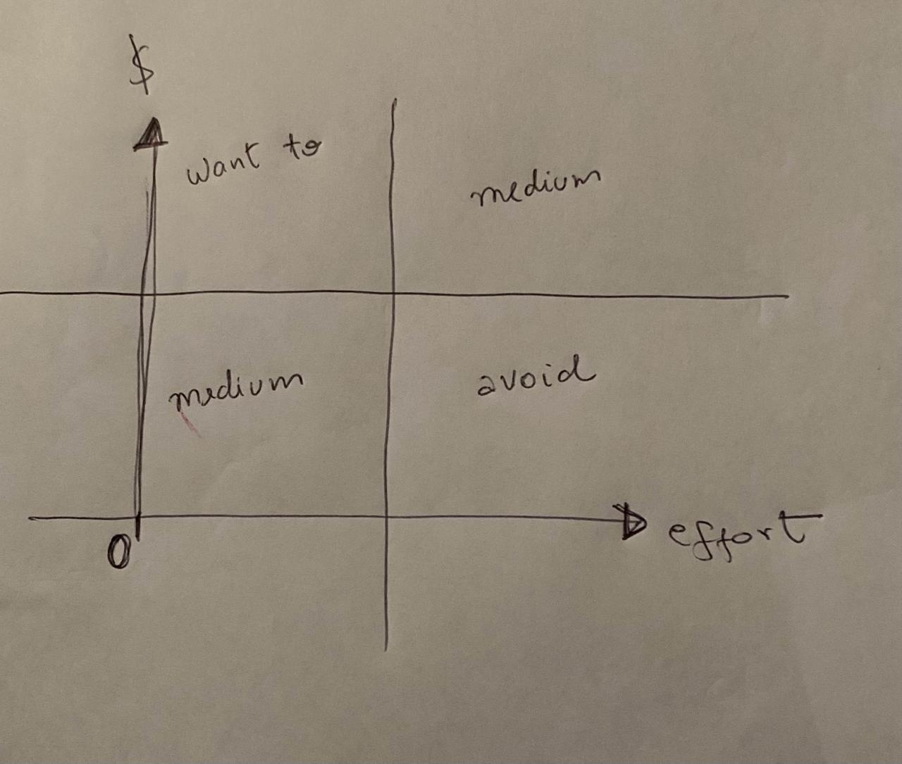

# Money shapes design #exploreAndExpand

## Survival

- What delimit design is the money and time that you have to spend
- Software teams should make decisions that will make the project up and running to see another day
- It's easy to perceive that design hinders experimentation and the better way to start something is just doing it, if you start to think about the whole lacks, issues, performance, and well-structured design, you NEVER will start, unless in the cases that you have experience with it. For this reason, the best way to move fast is, to hire the [top masters](../podcast-&-videos/a-philosophy-of-software-design-john-ousterhout.md#how-to-move-fast)

## NPV (Net present value)

Every feature should improve NPV, either increasing revenue or reducing cost.

## Optionality

Could this new feature open a door for new features and in the future increase my NPV? Maybe a High effort with low gains, could trigger and shape a lot of new favorable things and increase your gains exponentially. Maybe this is also your job.
