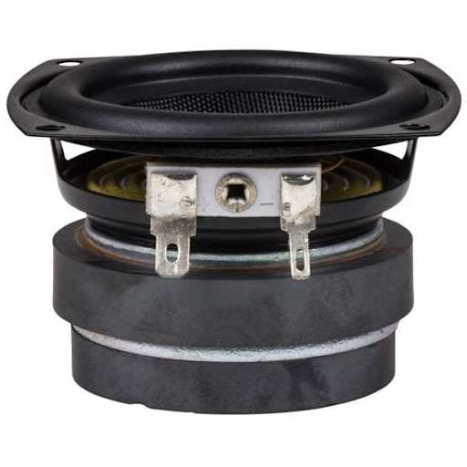
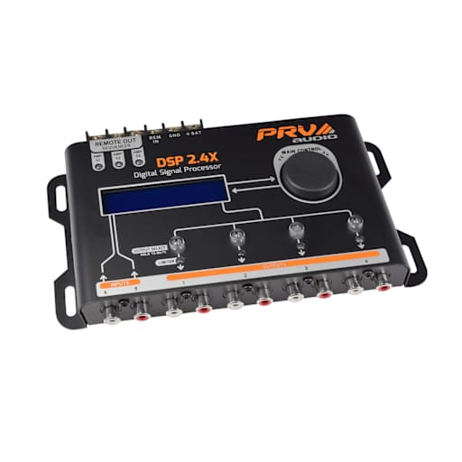
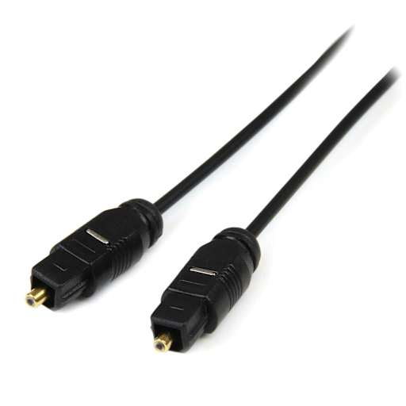

# Projeto: DIY Surround Sound com Transmissão por Laser

Este projeto consiste em um sistema de som surround sem fio que utiliza **transmissão óptica via laser** em vez de cabos tradicionais. O áudio é convertido para SPDIF/TOSLINK, transmitido por feixes de laser refletidos no teto e recebido por sensores TOSLINK nas caixas acústicas, que então reproduzem o som através de drivers Dayton amplificados com DSP por canal.

* Um driver Dayton é um driver de áudio que é usado para reproduzir áudio em uma caixa acústica.
* Um DSP de áudio é um dispositivo que recebe sinal digital ou analógico, processa (equaliza, crossovers, delays, etc.) e depois envia o sinal já tratado para os amplificadores.
* SPDIF é o padrão de interface digital (pode ser coaxial – RCA – ou óptico, via TOSLINK).
* TOSLINK é o conector e cabo de fibra óptica usado para transmitir o SPDIF digital, com luz vermelha dentro do cabo.

## Componentes principais

### Áudio e eletrônica

- Conversores SPDIF/TOSLINK analógico/digital (para transmissão).
- Conversores TOSLINK/digital-analógico (para recepção).
- Driver de baixa/midbass: **Dayton Audio TCP115-4** (4 ohms).
- Tweeter dos canais laterais: **Dayton Audio ND25FA-4**.
- Tweeter do canal central: **Dayton Audio ND25FN-4**.
- Amplificador de **4 canais**.
- DSP (equalização e crossovers por canal).
- Extração de áudio via **HDMI** do sistema de som surround.

- O DSP recebe o sinal digital, aplica equalização, crossovers e delays por canal, e entrega o sinal tratado para cada amplificador.

- SPDIF/TOSLINK: interface óptica digital usada para transmissão do áudio sem perdas entre os módulos.

### Transmissão a laser

- Diodos laser vermelhos de baixa potência (classe 1), usados no lugar do LED TOSLINK.
- Sensores/receptores TOSLINK nas caixas.
- Espelhos articuláveis para refletir o feixe.
- Peças impressas em 3D para suporte e ajuste dos espelhos.

### Estrutura das caixas

- Tubos acrílicos: 2 peças de 1000 mm, 70 mm de diâmetro externo e 66 mm interno.
- Gabinete principal, canal central, acopladores, tampas e dutos impressos em 3D.
- Mistura de **plaster of Paris** com **cola PVA** para massa e amortecimento.
- **Espuma acústica** e **lã de ovelha** para amortecimento interno.
- Cola para vedação hermética das junções.
- Parafusos para montagem das partes.

### Acabamento e montagem

- Filler/massa para acabamento.
- Primer plástico.
- Tinta com efeito **ferro envelhecido/texturizado**.
- Base de bambu/wooden foot para apoio.
- Suportes de parede para o canal central.

### Ferramentas e acessórios

- Chave de fenda multifuncional com catraca (ex.: LTT Ratcheting Multi-bit Screwdriver).
- Bornes de conexão (block terminal).
- Fonte de alimentação e cabos para amplificadores e módulos digitais.

## Objetivo do projeto

- Criar um sistema de **surround sound sem fios visíveis**, usando reflexão de laser no teto.
- Integrar DSP e equalização por canal para melhor qualidade sonora.
- Construir caixas acústicas rígidas e com boa massa usando combinação de plástico impresso em 3D, acrílico e enchimento.

# Lista de Materiais

# Orçamento

# Orçamento final estimado — Projeto DIY Surround Sound com Laser

Este documento reúne uma estimativa de custo para o projeto considerando que as peças de gabinete serão impressas por uma empresa especializada, já que não há impressora 3D disponível. Os valores são aproximados e servem como base para planejamento. As faixas de preço de impressão 3D e de alguns componentes foram obtidas em fontes consultadas neste turno. [web:71][web:72][web:73][web:85][web:86][web:87][web:88]

## Premissas

- Impressão terceirizada de todas as peças 3D do projeto.
- Compra dos componentes de áudio no Brasil ou na Europa.

## Estimativa por categoria

| Categoria | Itens incluídos | Faixa estimada |
| --- | --- | --- |
| Impressão 3D terceirizada | Gabinetes, suportes, espelhos e peças estruturais | R$ 1.200 a R$ 1.500 |
| Eletrônica e áudio | Conversores SPDIF/TOSLINK, drivers Dayton, amplificador, DSP e cabos | R$ 3.300 a R$ 5.000 |
| Materiais e acabamento | Tubos acrílicos, cola, espuma, lã, primer, tinta, parafusos e conexões | R$ 450 a R$ 900 |

## Detalhamento dos componentes

| Componente | Quantidade típica | Faixa unitária estimada | Total estimado |
| --- | --- | --- | --- |
| Conversor analógico → SPDIF/TOSLINK | 1 | R$ 70 a R$ 90 | R$ 80 |
| Conversor SPDIF/TOSLINK → analógico | 3 a 4 | R$ 90 a R$ 130 | R$ 300 a R$ 500 |
| Dayton TCP115-4 | 4 a 5 | R$ 250 a R$ 350 | R$ 1.000 a R$ 1.750 |
| Dayton ND25FA-4 | 4 a 6 | R$ 120 a R$ 180 | R$ 500 a R$ 1.000 |
| Dayton ND25FN-4 | 1 a 2 | R$ 120 a R$ 180 | R$ 120 a R$ 360 |
| Amplificador 4 canais | 1 a 2 | R$ 250 a R$ 500 | R$ 300 a R$ 800 |
| DSP | 1 | R$ 600 a R$ 1.200 | R$ 900 |
| Cabos e fixação | 1 kit | R$ 80 a R$ 150 | R$ 100 |

## Total estimado

- **Total mínimo aproximado:** R$ 4.900
- **Total máximo aproximado:** R$ 7.400
